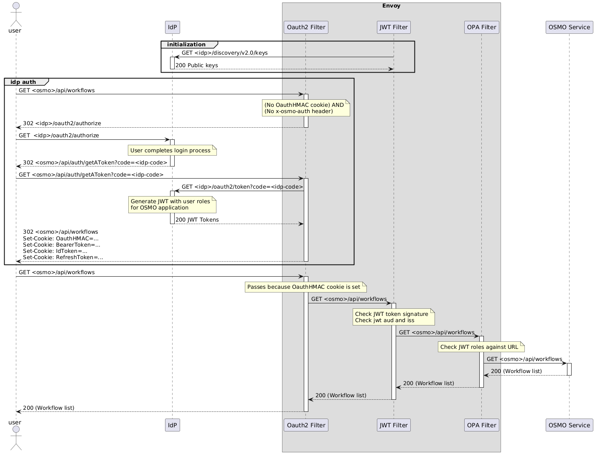

..
  SPDX-FileCopyrightText: Copyright (c) 2025 NVIDIA CORPORATION & AFFILIATES. All rights reserved.

  Licensed under the Apache License, Version 2.0 (the "License");
  you may not use this file except in compliance with the License.
  You may obtain a copy of the License at

  http://www.apache.org/licenses/LICENSE-2.0

  Unless required by applicable law or agreed to in writing, software
  distributed under the License is distributed on an "AS IS" BASIS,
  WITHOUT WARRANTIES OR CONDITIONS OF ANY KIND, either express or implied.
  See the License for the specific language governing permissions and
  limitations under the License.

  SPDX-License-Identifier: Apache-2.0

.. _authentication_flow_with_idp:

=======================================================
Authentication Flow with Identity Provider
=======================================================

This appendix describes the authentication flow in the OSMO platform when configured to use an identity provider (IdP) directly without Keycloak as an intermediary.

Architecture Components
-----------------------

The authentication system consists of the following components:

1. **User**: The end-user accessing the OSMO platform
2. **Identity Provider (IdP)**: External authentication service that verifies user identity
3. **Envoy**: API gateway that handles authentication and routing

   - **OAuth2 Filter**: Validates authentication tokens and cookies
   - **JWT Filter**: Validates JWT tokens and their claims
   - **OPA Filter**: Performs authorization based on policies
4. **OSMO Service**: Backend services that provide the platform functionality

Authentication Flow Diagram
---------------------------

The diagram below illustrates the authentication flow between the user, identity provider, and OSMO services:

.. note::
   The authentication flow diagram is based on the `OAuth 2.0 Authorization Framework <https://datatracker.ietf.org/doc/html/rfc6749#section-4.1>`_ specification.

Detailed Authentication Flow
----------------------------

The authentication process follows these steps:

Initialization
~~~~~~~~~~~~~~

1. During system initialization, the OSMO service retrieves the public keys from the identity provider.
2. The identity provider returns the public keys (HTTP 200) that will be used to verify JWT token signatures.

Initial Access Attempt
~~~~~~~~~~~~~~~~~~~~~~

1. The user attempts to access OSMO resources (e.g., ``GET <osmo>/api/workflows``).
2. The OAuth2 Filter in Envoy checks for authentication credentials and determines that:

   - No OAuthHMAC cookie is present
   - No x-osmo-auth header is present
3. Since the user is not authenticated, the OAuth2 Filter returns a redirect (HTTP 302) to the identity provider's authorization endpoint.

Authentication with Identity Provider
~~~~~~~~~~~~~~~~~~~~~~~~~~~~~~~~~~~~~

1. The user is redirected to the identity provider's authorization endpoint (``<idp>/oauth2/authorize``).
2. The user completes the login process with the identity provider.
3. Upon successful authentication, the identity provider redirects the user back to OSMO with an authorization code.

Token Exchange
~~~~~~~~~~~~~~

1. The OSMO service receives the authorization code and exchanges it for tokens by making a request to the identity provider's token endpoint (``GET <idp>/oauth2/token?code=<idp-code>``).
2. The identity provider generates a JWT with user roles specifically for the OSMO application.
3. The identity provider returns the JWT tokens (HTTP 200) to the OSMO service.

Session Establishment
~~~~~~~~~~~~~~~~~~~~~

1. The OSMO service receives the tokens and establishes a session for the user.
2. The service sets several cookies in the response (HTTP 302):

   - OAuthHMAC: A hash-based message authentication code for session identification
   - BearerToken: The access token for API requests
   - IdToken: Contains user identity information
   - RefreshToken: Used to obtain new tokens when the current ones expire

Authenticated Requests
~~~~~~~~~~~~~~~~~~~~~~

1. The user makes a subsequent request to access OSMO resources (``GET <osmo>/api/workflows``).
2. The request now includes the OAuthHMAC cookie set in the previous step.
3. The OAuth2 Filter validates the cookie and allows the request to proceed.
4. The request is forwarded to the JWT Filter, which:

   - Checks the JWT token signature
   - Validates the audience (aud) and issuer (iss) claims
5. The request then passes through the OPA Filter, which:

   - Checks the JWT roles against the requested URL
   - Ensures the user has appropriate permissions
6. If all checks pass, the request is forwarded to the OSMO Service.
7. The OSMO Service processes the request and returns the workflow list (HTTP 200) to the user.

Token Validation and Authorization
----------------------------------

JWT Token Validation
~~~~~~~~~~~~~~~~~~~~

The JWT Filter performs the following validations on each request:

1. **Signature Verification**: Ensures the token was issued by the trusted identity provider using the public keys obtained during initialization.
2. **Expiration Check**: Verifies that the token has not expired.
3. **Claim Validation**: Validates essential claims such as:

   - ``iss`` (Issuer): Must match the expected identity provider
   - ``aud`` (Audience): Must include the OSMO application
   - ``sub`` (Subject): Identifies the user

Role-Based Authorization
~~~~~~~~~~~~~~~~~~~~~~~~

The OPA Filter performs authorization based on the roles included in the JWT token:

1. **Role Extraction**: Extracts the roles from the JWT token.
2. **URL Matching**: Matches the requested URL against access control policies.
3. **Permission Check**: Determines if the user's roles grant access to the requested resource.

Example JWT Token
~~~~~~~~~~~~~~~~~

Below is an example of a JWT token payload used in the authentication flow:

.. code-block:: json

   {
     "exp": 1741819596,
     "iat": 1741819296,
     "jti": "4273aa49-bb31-420a-936a-54238388619f",
     "iss": "https://<your-idp-domain>/oauth2",
     "aud": "osmo-application",
     "sub": "<user-id>",
     "typ": "Bearer",
     "roles": [
       "osmo-admin",
       "dashboard-user",
       "osmo-user",
       "grafana-user"
     ],
     "name": "<user-name>",
     "preferred_username": "<user-email>",
     "given_name": "<user-first-name>",
     "family_name": "<user-last-name>"
   }

Token Lifecycle Management
--------------------------

Token Refresh
~~~~~~~~~~~~~

1. When the access token expires, the OSMO service uses the refresh token to obtain a new access token.
2. The service makes a request to the identity provider's token endpoint with the refresh token.
3. If the refresh token is valid, the identity provider issues new tokens without requiring re-authentication.
4. If the refresh token is expired or invalid, the user is redirected to the authentication flow.

Session Termination
~~~~~~~~~~~~~~~~~~~

1. When a user logs out or their session expires, the OAuthHMAC cookie and tokens are invalidated.
2. Subsequent requests will require re-authentication through the identity provider.

Security Considerations
-----------------------

When implementing and configuring the authentication flow, consider the following security aspects:

1. **Token Storage**: Tokens are stored securely in HTTP-only cookies to prevent cross-site scripting (XSS) attacks.
2. **HTTPS**: All communication between components uses HTTPS to encrypt data in transit.
3. **Token Expiration**: Access tokens have a short lifetime to minimize the impact of token theft.
4. **Envoy Filters**: Multiple layers of security filters (OAuth2, JWT, OPA) provide defense in depth.

Configuring Identity Provider Integration
-----------------------------------------

To configure the OSMO platform to use an identity provider directly, follow these steps:

1. **Identity Provider Configuration**:

   - Register OSMO as an application in your identity provider
   - Configure the redirect URIs to point to your OSMO instance
   - Set up appropriate scopes and claims

2. **Envoy Configuration**:

   - Configure the OAuth2 Filter with your identity provider's endpoints
   - Set up the JWT Filter with the appropriate validation parameters
   - Configure the OPA Filter with the necessary authorization policies

3. **OSMO Service Configuration**:

   - Configure the service to retrieve and validate public keys from the identity provider
   - Set up token handling and session management

Troubleshooting
---------------

If you encounter issues with the authentication flow, consider these common problems and solutions:

1. **Authentication Failures**:

   - Check the identity provider configuration
   - Verify that the redirect URIs are correctly configured
   - Ensure the client ID and secret are valid

2. **Token Validation Errors**:

   - Verify that the public keys are correctly retrieved from the identity provider
   - Check for clock skew between services
   - Ensure the JWT claims match the expected values

3. **Authorization Issues**:

   - Verify that the user has the necessary roles in the identity provider
   - Check the OPA policies for the requested resources
   - Review the JWT token to ensure it contains the expected roles

.. seealso::

   * :ref: `Authentication Flow with Keycloak <authentication_flow_with_keycloak>`_
