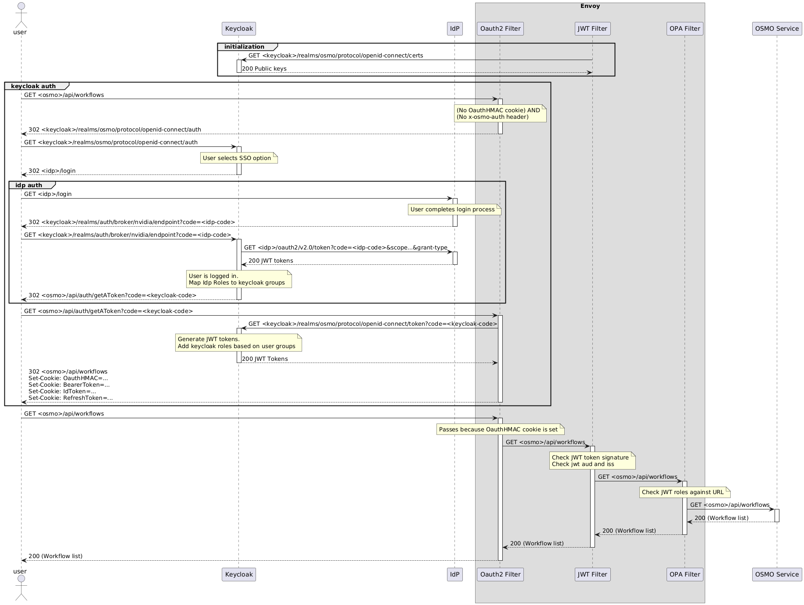

..
  SPDX-FileCopyrightText: Copyright (c) 2025 NVIDIA CORPORATION & AFFILIATES. All rights reserved.

  Licensed under the Apache License, Version 2.0 (the "License");
  you may not use this file except in compliance with the License.
  You may obtain a copy of the License at

  http://www.apache.org/licenses/LICENSE-2.0

  Unless required by applicable law or agreed to in writing, software
  distributed under the License is distributed on an "AS IS" BASIS,
  WITHOUT WARRANTIES OR CONDITIONS OF ANY KIND, either express or implied.
  See the License for the specific language governing permissions and
  limitations under the License.

  SPDX-License-Identifier: Apache-2.0

.. _authentication_flow_with_keycloak:

=================================================================
Authentication Flow with Keycloak and Identity Provider
=================================================================

This appendix describes the authentication flow in the OSMO platform when configured with Keycloak as the identity management solution and integrated with an external identity provider (IdP).

.. note::

   - This flow is used when your identity provider doesn't support passing roles/groups through OIDC then Keycloak is needed to do user/group management.
   - This flow is also used when you want to use multiple identity providers for login, then Keycloak can redirect to the appropriate identity provider and connect back to OSMO.

Architecture Components
-----------------------

The authentication system consists of the following components:

1. **User**: The end-user accessing the OSMO platform
2. **Keycloak**: The identity and access management solution that serves as an intermediary between users and identity providers
3. **Identity Provider (IdP)**: External authentication service (e.g., Microsoft Azure AD) that verifies user identity
4. **Envoy**: API gateway that handles authentication and routing

   - **OAuth2 Filter**: Validates authentication tokens and cookies
   - **JWT Filter**: Validates JWT tokens and their claims
   - **OPA Filter**: Performs authorization based on policies
5. **OSMO Service**: Backend services that provide the platform functionality

Authentication Flow Diagram
---------------------------

The diagram below illustrates the authentication flow between the user, Keycloak, identity provider, and OSMO services:

.. note::
   The authentication flow diagram is based on the `OAuth 2.0 Authorization Framework <https://datatracker.ietf.org/doc/html/rfc6749#section-4.1>`_ specification.

Detailed Authentication Flow
----------------------------

The authentication process follows these steps:

Initialization
~~~~~~~~~~~~~~

1. During system initialization, the OSMO service retrieves the public keys from Keycloak by making a request to ``GET <keycloak>/realms/osmo/protocol/openid-connect/certs``.
2. Keycloak returns the public keys (HTTP 200) that will be used to verify JWT token signatures.

Initial Access Attempt
~~~~~~~~~~~~~~~~~~~~~~

1. The user attempts to access OSMO resources (e.g., ``GET <osmo>/api/workflows``).
2. The OAuth2 Filter in Envoy checks for authentication credentials and determines that:

   - No OAuthHMAC cookie is present
   - No x-osmo-auth header is present
3. Since the user is not authenticated, the OAuth2 Filter returns a redirect (HTTP 302) to Keycloak's authentication endpoint.

Keycloak Authentication
~~~~~~~~~~~~~~~~~~~~~~~

1. The user is redirected to Keycloak's authentication endpoint (``GET <keycloak>/realms/osmo/protocol/openid-connect/auth``).
2. Keycloak presents the login options to the user, who selects the SSO option to authenticate with the external identity provider.
3. Keycloak redirects the user to the identity provider's login page (HTTP 302 to ``<idp>/login``).

Identity Provider Authentication
~~~~~~~~~~~~~~~~~~~~~~~~~~~~~~~~

1. The user completes the login process with the identity provider.
2. Upon successful authentication, the identity provider redirects the user back to Keycloak with an authorization code (HTTP 302 to ``<keycloak>/realms/auth/broker/nvidia/endpoint?code=<idp-code>``).

Token Exchange and User Mapping
~~~~~~~~~~~~~~~~~~~~~~~~~~~~~~~

1. Keycloak receives the authorization code and exchanges it for tokens by making a request to the identity provider's token endpoint (``GET <idp>/oauth2/v2.0/token?code=<idp-code>&...&grant_type=authorization_code``).
2. The identity provider returns JWT tokens (HTTP 200) to Keycloak.
3. Keycloak processes the user information:

   - The user is logged in to Keycloak
   - Identity provider roles are mapped to Keycloak groups

OSMO Token Generation
~~~~~~~~~~~~~~~~~~~~~

1. The user is redirected to OSMO with a Keycloak authorization code (HTTP 302 to ``<osmo>/api/auth/getAToken?code=<keycloak-code>``).
2. The OSMO service exchanges this code for tokens by making a request to Keycloak (``GET <keycloak>/realms/osmo/protocol/openid-connect/token?code=<keycloak-code>&...&grant_type=authorization_code``).
3. Keycloak generates JWT tokens with user roles based on the user's group memberships and returns them to the OSMO service (HTTP 200).

Session Establishment
~~~~~~~~~~~~~~~~~~~~~

1. The OSMO service receives the tokens and establishes a session for the user.
2. The service sets several cookies in the response (HTTP 302):

   - OAuthHMAC: A hash-based message authentication code for session identification
   - BearerToken: The access token for API requests
   - IdToken: Contains user identity information
   - RefreshToken: Used to obtain new tokens when the current ones expire

Authenticated Requests
~~~~~~~~~~~~~~~~~~~~~~

1. The user makes a subsequent request to access OSMO resources (``GET <osmo>/api/workflows``).
2. The request now includes the OAuthHMAC cookie set in the previous step.
3. The OAuth2 Filter validates the cookie and allows the request to proceed because OAuthHMAC cookie is set.
4. The request is forwarded to the JWT Filter, which:

   - Checks the JWT token signature
   - Validates the audience (aud) and issuer (iss) claims
5. The request then passes through the OPA Filter, which:

   - Checks the JWT roles against the requested URL
   - Ensures the user has appropriate permissions
6. If all checks pass, the request is forwarded to the OSMO Service.
7. The OSMO Service processes the request and returns the workflow list (HTTP 200) to the user.

Token Validation and Authorization
----------------------------------

JWT Token Validation
~~~~~~~~~~~~~~~~~~~~

The JWT Filter performs the following validations on each request:

1. **Signature Verification**: Ensures the token was issued by Keycloak using the public keys obtained during initialization.
2. **Expiration Check**: Verifies that the token has not expired.
3. **Claim Validation**: Validates essential claims such as:

   - ``iss`` (Issuer): Must match the expected Keycloak realm URL
   - ``aud`` (Audience): Must include the OSMO client ID
   - ``sub`` (Subject): Identifies the user

Role-Based Authorization
~~~~~~~~~~~~~~~~~~~~~~~~

The OPA Filter performs authorization based on the roles included in the JWT token:

1. **Role Extraction**: Extracts the roles from the JWT token.
2. **URL Matching**: Matches the requested URL against access control policies.
3. **Permission Check**: Determines if the user's roles grant access to the requested resource.

Example JWT Token
~~~~~~~~~~~~~~~~~

Below is an example of a JWT token payload used in the authentication flow:

.. code-block:: json

   {
     "exp": 1741819596,
     "iat": 1741819296,
     "jti": "4273aa49-bb31-420a-936a-54238388619f",
     "iss": "https://<your-keycloak-domain>/realms/osmo",
     "aud": "osmo-browser-flow",
     "sub": "<user-id>",
     "typ": "ID",
     "azp": "osmo-browser-flow",
     "sid": "<session-id>",
     "at_hash": "<hash>",
     "roles": [
       "osmo-admin",
       "dashboard-user",
       "osmo-user",
       "grafana-user",
       "dashboard-admin",
       "osmo-sre",
       "grafana-admin"
     ],
     "name": "<user-name>",
     "preferred_username": "<user-email>",
     "given_name": "<user-first-name>",
     "family_name": "<user-last-name>"
   }

Token Lifecycle Management
--------------------------

Token Refresh
~~~~~~~~~~~~~

1. When the access token expires, the OSMO service uses the refresh token to obtain a new access token.
2. If the refresh token is valid, Keycloak issues a new access token without requiring re-authentication.
3. If the refresh token is expired or invalid, the user is redirected to the authentication flow.

Identity Provider Configuration
-------------------------------

An example of the identity provider settings for the OSMO platform with Microsoft Azure AD as the identity provider:

.. code-block:: json

   {
     "alias": "nvidia",
     "displayName": "NVIDIA (Microsoft AD)",
     "providerId": "oidc",
     "enabled": true,
     "updateProfileFirstLoginMode": "on",
     "trustEmail": false,
     "storeToken": false,
     "addReadTokenRoleOnCreate": false,
     "authenticateByDefault": false,
     "linkOnly": false,
     "firstBrokerLoginFlowAlias": "first broker login",
     "config": {
       "userInfoUrl": "https://graph.microsoft.com/oidc/userinfo",
       "validateSignature": "true",
       "tokenUrl": "https://login.microsoftonline.com/{tenant-id}/oauth2/v2.0/token",
       "clientId": "{client-id}",
       "jwksUrl": "https://login.microsoftonline.com/{tenant-id}/discovery/v2.0/keys",
       "issuer": "https://login.microsoftonline.com/{tenant-id}/v2.0",
       "useJwksUrl": "true",
       "pkceEnabled": "false",
       "authorizationUrl": "https://login.microsoftonline.com/{tenant-id}/oauth2/v2.0/authorize",
       "clientAuthMethod": "client_secret_post",
       "logoutUrl": "https://login.microsoftonline.com/{tenant-id}/oauth2/v2.0/logout",
       "clientSecret": "{client-secret}"
     }
   }

Adding a New Identity Provider
------------------------------

To add a new identity provider to the OSMO Keycloak configuration, follow these steps:

1. **Create Identity Provider in Keycloak**:

   - Log in to the Keycloak Admin Console
   - Navigate to Identity Providers
   - Click "Add provider" and select the appropriate provider type (OIDC, SAML, etc.)
   - Configure the provider with the necessary endpoints and credentials

2. **Configure Authentication Flow**:

   - Ensure the "browser" flow includes the "identity-provider-redirect" authenticator
   - Configure the "first broker login" flow according to your requirements

3. **Set Up Identity Provider Mappers**:

   - Create mappers to map identity provider claims to Keycloak user attributes
   - Set up group mappers to assign users to appropriate groups based on claims

4. **Update Realm Configuration**:

   - Add the identity provider configuration to the appropriate realm JSON file
   - Include any necessary identity provider mappers

5. **Deploy Updated Configuration**:

   - Apply the updated configuration to your Keycloak instance
   - Test the authentication flow with the new identity provider

Troubleshooting
---------------

If you encounter issues with the authentication flow, consider these common problems and solutions:

1. **User Cannot Log In**:

   - Verify identity provider configuration
   - Check identity provider logs for authentication errors
   - Ensure the user has the necessary permissions in the identity provider

2. **Missing Group Memberships**:

   - Verify identity provider mapper configuration
   - Check that the expected claims are present in the identity provider token
   - Review Keycloak logs for mapping errors

3. **Token Validation Failures**:

   - Ensure Keycloak's public key is correctly configured in OSMO services
   - Check for clock skew between services
   - Verify token signature algorithm matches the expected algorithm

.. seealso::

   * :ref:`Authentication Flow with Identity Provider <authentication_flow_with_idp>`
   * `Keycloak Documentation <https://www.keycloak.org/documentation>`_
