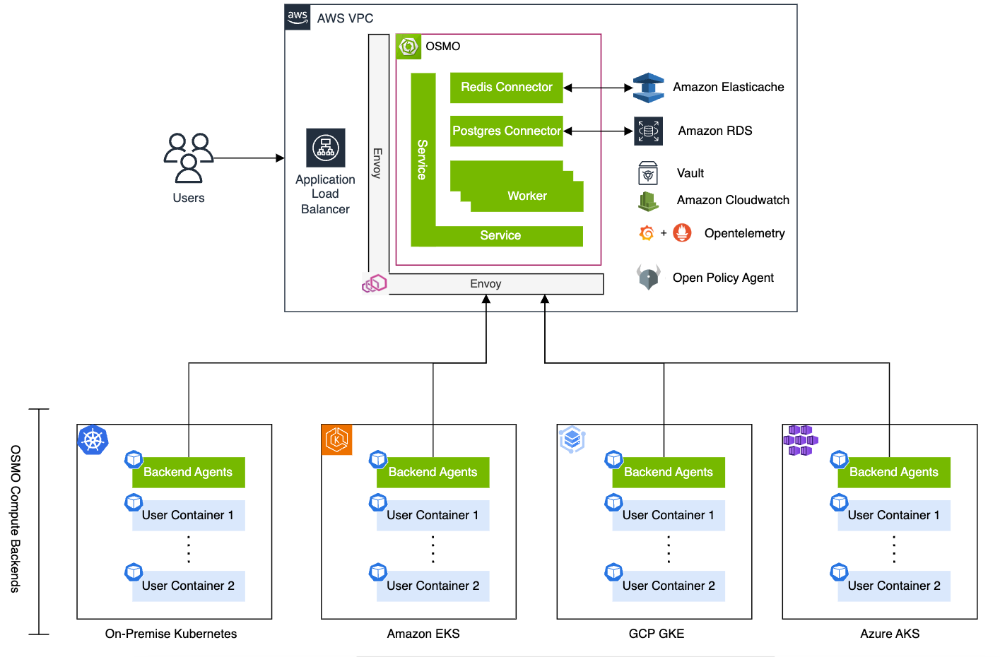

..
  SPDX-FileCopyrightText: Copyright (c) 2025 NVIDIA CORPORATION & AFFILIATES. All rights reserved.

  Licensed under the Apache License, Version 2.0 (the "License");
  you may not use this file except in compliance with the License.
  You may obtain a copy of the License at

  http://www.apache.org/licenses/LICENSE-2.0

  Unless required by applicable law or agreed to in writing, software
  distributed under the License is distributed on an "AS IS" BASIS,
  WITHOUT WARRANTIES OR CONDITIONS OF ANY KIND, either express or implied.
  See the License for the specific language governing permissions and
  limitations under the License.

  SPDX-License-Identifier: Apache-2.0

.. _architecture:

=======================================================
Architecture
=======================================================

Service
~~~~~~~

The service is an API server that provides a RESTful API for the OSMO platform.
It is responsible for, but not limited to:

- Submitting workflows
- Querying information about workflows
- Querying information about compute resources available
- Managing datasets
- Setting service configurations
- Authentication and authorization

The service is comprised of the following components:

- **Core Service**: Handles the responsibilities listed above
- **Worker**: Manages the lifecycle of workflows from submission to completion, and uploads workflow artifacts to cloud storage
- **Agent**: Receives state information from compute backend and schedules jobs to update workflow state
- **Delayed Job Monitor**: Monitors and enqueues jobs that have a scheduled timestamp in the future
- **Logger**: Streams workflow logs to users
- **Router**: Enables `exec`, `port-forward`, and `rsync` for user workflows through bidirectional data transfer between users and the compute backend

Backend Operators
~~~~~~~~~~~~~~~~~

Backend operators form an internal service on the compute backend cluster for managing Kubernetes resources to support workflow execution
and reporting state information to the core service. They are comprised of the following components:

- **Backend Listener**: Receives granular status and conditions information from Kubernetes resources and transmits it to the core service
- **Backend Worker**: Manages the creation and deletion of Kubernetes resources to support workflow execution

.. note::

    The core service and worker are usually deployed on the separate cluster from the backend operators.
    The backend operators are deployed on the compute backend cluster, where user-submitted workflows are run.
