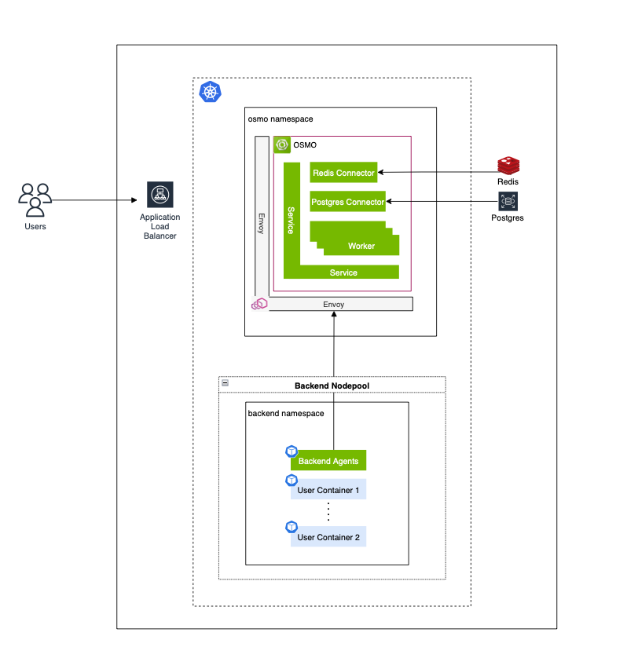
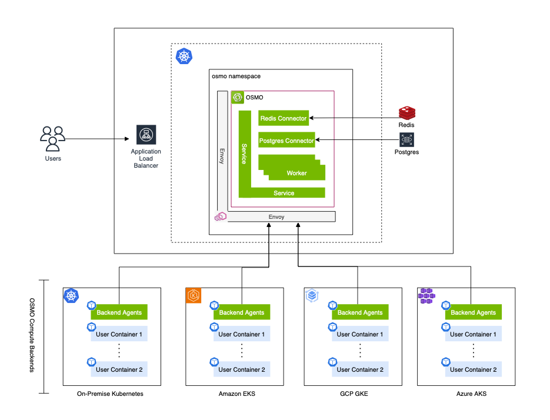
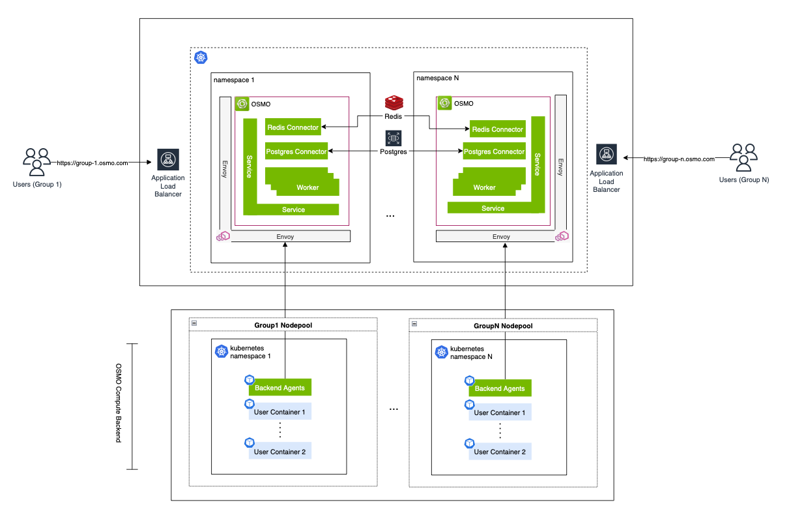
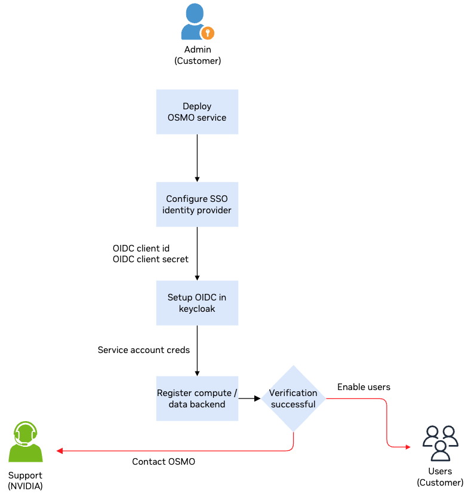
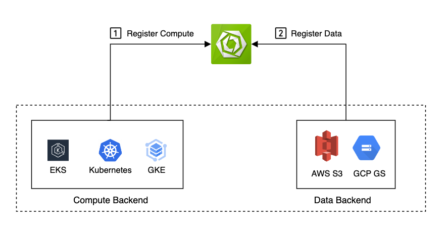

..
  SPDX-FileCopyrightText: Copyright (c) 2025 NVIDIA CORPORATION & AFFILIATES. All rights reserved.

  Licensed under the Apache License, Version 2.0 (the "License");
  you may not use this file except in compliance with the License.
  You may obtain a copy of the License at

  http://www.apache.org/licenses/LICENSE-2.0

  Unless required by applicable law or agreed to in writing, software
  distributed under the License is distributed on an "AS IS" BASIS,
  WITHOUT WARRANTIES OR CONDITIONS OF ANY KIND, either express or implied.
  See the License for the specific language governing permissions and
  limitations under the License.

  SPDX-License-Identifier: Apache-2.0

=======================
OSMO Deployment Guide
=======================

There are several ways to deploy OSMO depending on your use case.

1. Minimal deployment (single-tenant sandbox)
2. Full deployment (single-tenant)
3. Multi-tenant deployment at scale

Minimal Deployment
------------------

Minimal deployment is a single-tenant sandbox deployment that is used to test the OSMO service. It is a good way to get started with OSMO and to understand the service.

For the minimal deployment the OSMO services and backend are deployed on the same Kubernetes cluster. There will be no authentication setup for this deployment. If this is the deployment you are looking for, please refer to the :ref:`Quick Start Deployment <deploy_quickstart>` section.

Full Deployment
---------------

Full deployment is a single-tenant deployment that is used to deploy OSMO on a Kubernetes cluster. It is a good way to deploy OSMO on a Kubernetes cluster and to understand the service.

For the full deployment the OSMO services and backend are deployed on different Kubernetes clusters where users are authenticated using a single sign-on (SSO) provider. If this is the deployment you are looking for, please refer to the :ref:`Full Deployment <deploy_single_tenant>` section.

Multi-tenant Deployment at Scale
--------------------------------

Multi-tenant deployment at scale is a deployment that is used to deploy OSMO on a Kubernetes cluster for multiple tenants. It is a good way to deploy OSMO on a Kubernetes cluster for multiple tenants and to understand the service.

For the multi-tenant deployment at scale the OSMO services and backend are deployed on different Kubernetes clusters where each tenant is isolated from the other. Users are authenticated using a single sign-on (SSO) provider. There will be authentication setup for this deployment. If this is the deployment you are looking for, please refer to the :ref:`Multi-tenant Deployment at Scale <deploy_multitenant>` section.

If you are doing a full or multi-tenant deployment, familiarize yourself with the on-boarding process below that defines multiple roles.

Next, proceed with registering your compute backend and data backend with OSMO to run workflows.

* Step 1: Follow :ref:`register_cb` to set up compute cluster and register with OSMO.
* Step 2: Refer to :ref:`data` to create data bucket based on storage solution of your choice to run workflows on OSMO.
* Step 3: Use :doc:`Configuration <references/index>` to configure OSMO.

.. toctree::
  :hidden:
  :maxdepth: 2

  concepts/index
  install/index
  references/index
  appendix/index
