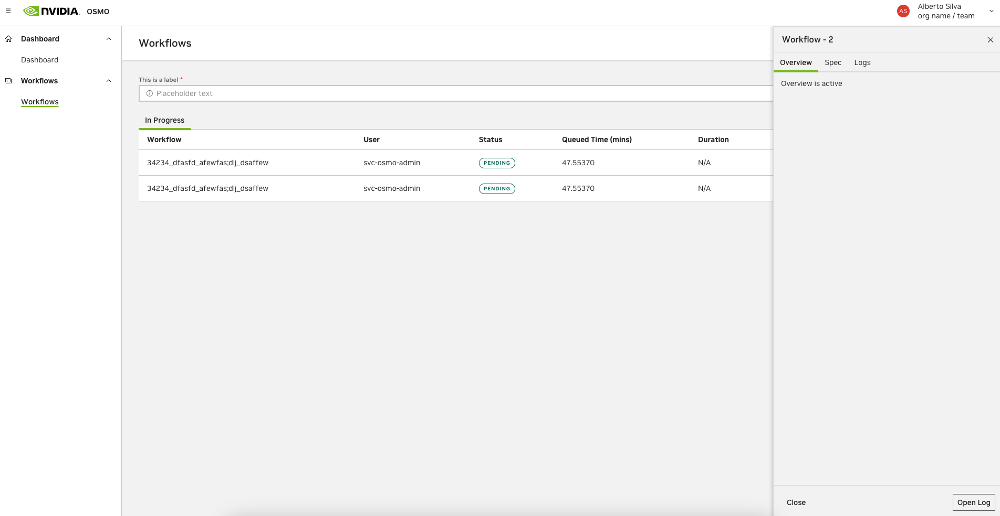

..
  SPDX-FileCopyrightText: Copyright (c) 2025 NVIDIA CORPORATION & AFFILIATES. All rights reserved.

  Licensed under the Apache License, Version 2.0 (the "License");
  you may not use this file except in compliance with the License.
  You may obtain a copy of the License at

  http://www.apache.org/licenses/LICENSE-2.0

  Unless required by applicable law or agreed to in writing, software
  distributed under the License is distributed on an "AS IS" BASIS,
  WITHOUT WARRANTIES OR CONDITIONS OF ANY KIND, either express or implied.
  See the License for the specific language governing permissions and
  limitations under the License.

  SPDX-License-Identifier: Apache-2.0

.. _wf_list:

=====
List
=====

You can monitor all the workflows submitted by you or others with the list command.
``FAILED_SUBMISSION`` is not listed unless specified.

.. code-block:: bash

  $ osmo workflow list -h
  usage: osmo workflow list [-h] [--count COUNT] [--name NAME] [--order {asc,desc}] [--status STATUS [STATUS ...]] [--format-type {json,text}] [--submitted-after SUBMITTED_AFTER] [--submitted-before SUBMITTED_BEFORE] [--tags TAGS [TAGS ...]]
                            [--priority {HIGH,NORMAL,LOW} [{HIGH,NORMAL,LOW} ...]] [--user USER [USER ...] | --all-users] [--pool POOL [POOL ...]] [--app APP]

  options:
    -h, --help            show this help message and exit
    --count COUNT, -c COUNT
                          Display the given count of workflows. Default value is 20.
    --name NAME, -n NAME  Display workflows which contains the string.
    --order {asc,desc}, -o {asc,desc}
                          Display in the order in which workflows were submitted. asc means latest at the bottom. desc means latest at the top. Default is asc.
    --status STATUS [STATUS ...], -s STATUS [STATUS ...]
                          Display all workflows with the given status(es). Users can pass multiple values to this flag. Acceptable values: RUNNING, FAILED, COMPLETED, PENDING, WAITING, FAILED_EXEC_TIMEOUT, FAILED_SERVER_ERROR, FAILED_QUEUE_TIMEOUT, FAILED_SUBMISSION,
                          FAILED_CANCELED, FAILED_BACKEND_ERROR, FAILED_IMAGE_PULL, FAILED_EVICTED, FAILED_START_ERROR, FAILED_START_TIMEOUT, FAILED_PREEMPTED
    --format-type {json,text}, -t {json,text}
                          Specify the output format type (Default text).
    --submitted-after SUBMITTED_AFTER
                          Filter for workflows that were submitted after AND including this date. Must be in format YYYY-MM-DD. Example: --submitted-after 2023-05-03
    --submitted-before SUBMITTED_BEFORE
                          Filter for workflows that were submitted before (NOT including) this date. Must be in format YYYY-MM-DD. Example: --submitted-after 2023-05-02 --submitted-before 2023-05-04 includes all workflows that were submitted any time on May 2nd and May 3rd only.
    --tags TAGS [TAGS ...]
                          Filter for workflows that contain the tag(s).
    --priority {HIGH,NORMAL,LOW} [{HIGH,NORMAL,LOW} ...]
                          Filter workflows by priority levels.
    --user USER [USER ...], -u USER [USER ...]
                          Display all workflows by this user. Users can pass multiple values to this flag.
    --all-users, -a       Display all workflows with no filtering on users.
    --pool POOL [POOL ...], -p POOL [POOL ...]
                          Display all workflows by this pool. Users can pass multiple values to this flag.
    --app APP, -P APP     Display all workflows created by this app. For a specific app or app version, use the format <app>:<version>.

  Sample usage below to list the running workflows from all users

.. code-block:: bash
  :substitutions:

  $ osmo workflow list --status PENDING RUNNING --all-users
  User            Workflow ID                                               Submit Time          Status   Priority  Overview
  =============================================================================================================================================================================================
  svc-osmo-admin  isaac_ros_detectnet_graph-1          2023-04-21 06:05:35  RUNNING  HIGH      |osmo_url|/workflows/isaac_ros_detectnet_graph-1/logs

  svc-osmo-admin  apriltag_ros_apriltag_node-1         2023-04-21 06:05:45  PENDING  LOW       |osmo_url|/workflows/apriltag_ros_apriltag_node-1/logs

  svc-osmo-admin  isaac_ros_visual_slam_node-1         2023-04-21 06:05:47  RUNNING  NORMAL    |osmo_url|/workflows/isaac_ros_visual_slam_node-1/logs

Workflows can be monitored purely on the `web UI <osmo_ui_workflows_>`_ without any local installation.

If you want to list workflows created by a specific app, you can use the ``--app`` flag.

.. code-block:: bash

  $ osmo workflow list --app my-app
