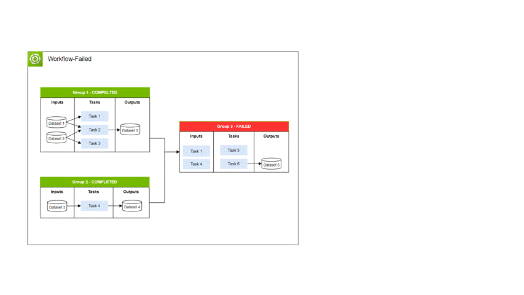
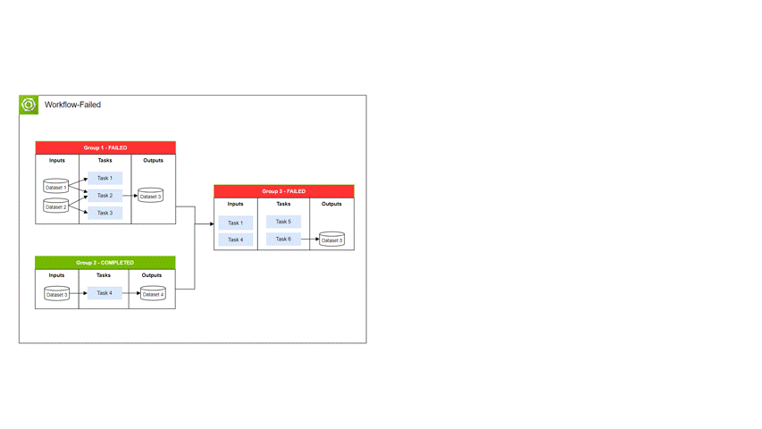

..
  SPDX-FileCopyrightText: Copyright (c) 2025 NVIDIA CORPORATION & AFFILIATES. All rights reserved.

  Licensed under the Apache License, Version 2.0 (the "License");
  you may not use this file except in compliance with the License.
  You may obtain a copy of the License at

  http://www.apache.org/licenses/LICENSE-2.0

  Unless required by applicable law or agreed to in writing, software
  distributed under the License is distributed on an "AS IS" BASIS,
  WITHOUT WARRANTIES OR CONDITIONS OF ANY KIND, either express or implied.
  See the License for the specific language governing permissions and
  limitations under the License.

  SPDX-License-Identifier: Apache-2.0

.. _wf_restart:

================================================
Restart
================================================

Restarting a workflow will fetch the contents of the given workflow, restart all **FAILED groups**,
validate the workflow spec for usage errors, resource availability, credential validity and then submit the job to the job queue.
If submission was successful, it will provide a workflow ID and link to the real-time logs streaming from the container executed on the compute node:

.. code-block:: bash

  $ osmo workflow restart -h
  usage: osmo workflow restart [-h] [--format-type {json,text}] [--pool POOL] workflow_id

  positional arguments:
    workflow_id           The workflow ID or UUID to restart.

  options:
    -h, --help            show this help message and exit
    --format-type {json,text}, -t {json,text}
                          Specify the output format type (Default text).
    --pool POOL, -p POOL  The target pool to run the workflow with.

An example of submitting a workflow spec is shown below:

.. code-block:: bash
  :substitutions:

  $ osmo workflow restart sim-sdg-1
  Workflow sim-sdg-1 restarted.
      Workflow ID   - sim-sdg-2
      Workflow Overview - |osmo_url|/workflows/sim-sdg-2/logs
      Workflow Dash - |osmo_url|/backend-dashboard/#/search?namespace=_all&q=vsoalgepxjbv7egb6ljml6ng4m

The workflow dashboard provides direct access for debugging and remote development for users. The link is only valid for ``PENDING`` and ``RUNNING`` workflows

Refer to :ref:`faqs` to use the dashboard for live debug.

.. note::

  If a usage, resource, or credential error code is encountered, the CLI will exit with error code 1, indicating that the workflow failed submission.
  Refer to :ref:`troubleshooting` for tips for debugging

Below are some examples of how the restarted workflow will run:

Because both ``Task 1`` and ``Task 2`` completed and ``Task 3`` failed, only ``Task 3`` is restarted and the
outputs of ``Task 1`` and ``Task 2`` are used.

Because just ``Task 2`` completed and ``Task 3`` failed due to ``Task 1`` failing, ``Task 1`` and ``Task 3`` are
restarted and the outputs of ``Task 2`` are used for ``Task 3``.
