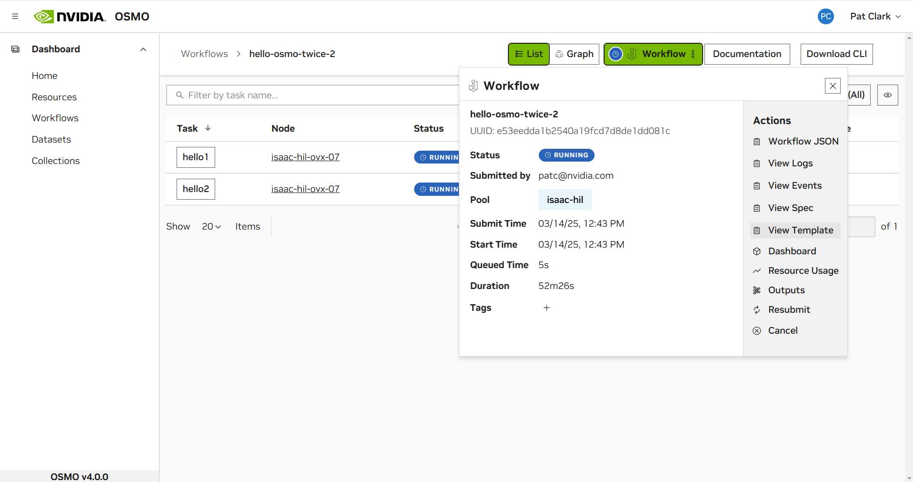

..
  SPDX-FileCopyrightText: Copyright (c) 2025 NVIDIA CORPORATION & AFFILIATES. All rights reserved.

  Licensed under the Apache License, Version 2.0 (the "License");
  you may not use this file except in compliance with the License.
  You may obtain a copy of the License at

  http://www.apache.org/licenses/LICENSE-2.0

  Unless required by applicable law or agreed to in writing, software
  distributed under the License is distributed on an "AS IS" BASIS,
  WITHOUT WARRANTIES OR CONDITIONS OF ANY KIND, either express or implied.
  See the License for the specific language governing permissions and
  limitations under the License.

  SPDX-License-Identifier: Apache-2.0

.. _wf_spec:

================================================
Spec
================================================

There are two methods of viewing workflow specs - through the browser or the CLI.

Browser
-------

The workflow **Spec** and **Template** are available in the ``actions menu`` on the **workflow details page**.

Console
--------

You can view your workflow spec after you submit your workflow:

.. code-block:: bash

  $ osmo workflow spec -h
    usage: osmo workflow spec [-h] [--template] workflow_id

    positional arguments:
    workflow_id  The workflow ID or UUID to query the status of.

    options:
    -h, --help   show this help message and exit
    --template   Show the original templated spec

    An example of submitting a workflow spec is shown below:

An example of requesting for a workflow spec:

.. code-block:: bash

  $ osmo workflow spec sim-sdg-1

The returned spec is a processed version of the original spec that has gone through Jinja templating.
If you wish to see the original spec, you can use the ``--template`` flag:

.. code-block:: bash

  $ osmo workflow spec sim-sdg-1 --template

To see your workflow spec on the browser, go to:

.. code-block:: bash
  :substitutions:

  |osmo_url|/api/workflow/<workflow_id>/spec

To see the original spec on the browser, go to:

.. code-block:: bash
  :substitutions:

  |osmo_url|/api/workflow/<workflow_id>/spec?template=True
