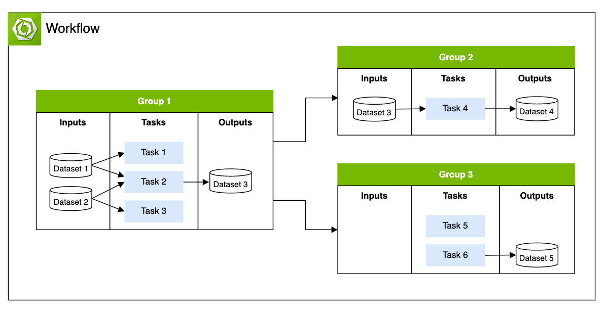

..
  SPDX-FileCopyrightText: Copyright (c) 2025 NVIDIA CORPORATION & AFFILIATES. All rights reserved.

  Licensed under the Apache License, Version 2.0 (the "License");
  you may not use this file except in compliance with the License.
  You may obtain a copy of the License at

  http://www.apache.org/licenses/LICENSE-2.0

  Unless required by applicable law or agreed to in writing, software
  distributed under the License is distributed on an "AS IS" BASIS,
  WITHOUT WARRANTIES OR CONDITIONS OF ANY KIND, either express or implied.
  See the License for the specific language governing permissions and
  limitations under the License.

  SPDX-License-Identifier: Apache-2.0

.. _concepts_wf:

================================================
Workflows & Tasks
================================================

A **workflow** is a user-defined, directed acyclic graph (DAG) of tasks that need to be executed
in a pool.

A **task** is an independent environment designed to run a list of commands within a Docker
container. These tasks can utilize files produced by upstream tasks dependencies and can also
upload to or download data from various data storage solutions provided by cloud service providers
including AWS S3, Google Cloud Storage, and Azure Blob Storage.

A **group** enables you to synchronize the execution of a collection of tasks and to
interact with each other within the network. When a group is defined, it must have a single task
designated as the **group leader**.

It is possible that the collection of tasks inside a group can all run on the same node or on
different nodes of homogeneous architectures (for example, amd64) or
heterogeneous architecture (for example, amd64 and arm64) depending on it's resource requirement
and availability in the pool.

For example, the diagram below shows the following behavior with a workflow with three groups:

1. ``Group 1`` runs three tasks concurrently with two datasets as inputs.
2. ``Group 1`` exits when the group leader ``Task 2`` finishes writing it's output to ``Dataset 3``.
3. ``Group 2`` and ``Group 3`` start executing after ``Group 1`` is finished.
4. ``Group 2`` uses the dataset created by ``Group 1`` as input.
5. Both ``Group 2`` and ``Group 3`` output their own datasets.

Workflows can be classified broadly into the following major types based on the dependency defined
in the workflow DAG:

* `Serial Workflows` - Workflows that define tasks to execute after one another
* `Parallel Workflows` - Workflows that define groups of tasks that execute simultaneously
* `Combination Workflows` - Workflows that are serial and parallel relationships

.. toctree::
  :hidden:

  lifecycle/index
  priority
  specification/index
  interaction/index
  apps
