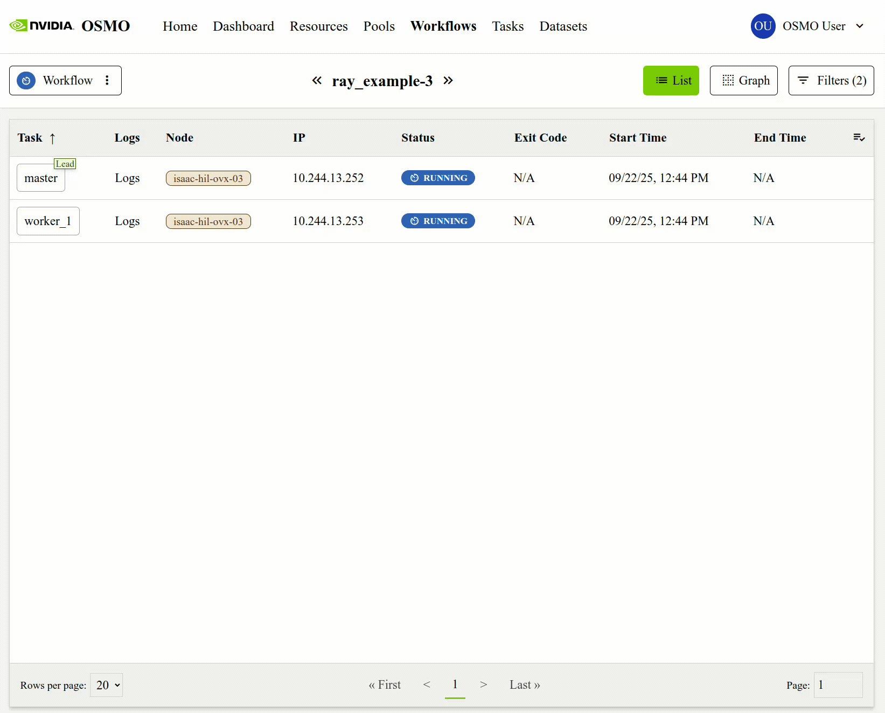

..
  SPDX-FileCopyrightText: Copyright (c) 2025 NVIDIA CORPORATION & AFFILIATES. All rights reserved.

  Licensed under the Apache License, Version 2.0 (the "License");
  you may not use this file except in compliance with the License.
  You may obtain a copy of the License at

  http://www.apache.org/licenses/LICENSE-2.0

  Unless required by applicable law or agreed to in writing, software
  distributed under the License is distributed on an "AS IS" BASIS,
  WITHOUT WARRANTIES OR CONDITIONS OF ANY KIND, either express or implied.
  See the License for the specific language governing permissions and
  limitations under the License.

  SPDX-License-Identifier: Apache-2.0

.. _wf_port_forward:

============
Port-Forward
============

You can port-forward from a running task in the workflow through the browser or the CLI.

Browser
-------

Forwarding a port through the browser is useful when your task has a web service running that
listens on a single port and serves http traffic, such as a :ref:`Jupyter Notebook <workflow_examples>`,
a :ref:`VSCode Server <workflow_examples>` or a :ref:`Ray dashboard <workflow_examples>`.

You can forward a port from **a running workflow task** in the browser using the ``Port Forward``
option in the ``Task Details`` menu for that task. You may select the task, enter the port number
and click on ``Start`` to forward the port.

.. note::

  The browser port-forward feature can be disabled by administrators.
  In such case you will not see the option to forward ports for a running task.

CLI
---

Forward ports from a running task of your workflow to your local host or browser using ``port-forward`` command.
For detailed CLI options, see :ref:`cli_reference_workflow`.

If your workflow is hosting a **web application** that listens on a **single** port, you can go to the URL provided after running port forwarding to view
the application through your web browser. If your workflow is hosting a more complex service like Isaac Sim, you can
need to use the a corresponding local client to access the service.

For examples of common services that can be port forwarded,
see `integration & tools <https://github.com/ai-osmo/osmo/tree/main/workflow_examples/integration_and_tools>`_.
