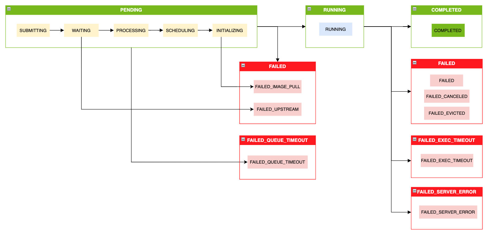

..
  SPDX-FileCopyrightText: Copyright (c) 2025 NVIDIA CORPORATION & AFFILIATES. All rights reserved.

  Licensed under the Apache License, Version 2.0 (the "License");
  you may not use this file except in compliance with the License.
  You may obtain a copy of the License at

  http://www.apache.org/licenses/LICENSE-2.0

  Unless required by applicable law or agreed to in writing, software
  distributed under the License is distributed on an "AS IS" BASIS,
  WITHOUT WARRANTIES OR CONDITIONS OF ANY KIND, either express or implied.
  See the License for the specific language governing permissions and
  limitations under the License.

  SPDX-License-Identifier: Apache-2.0

.. _concepts_wf_status:

Status
=========

Workflow Status Transition Diagram
-----------------------------------

The workflow **status** changes based on the groups' progression.

Workflow Statuses
--------------------

The following is a list of possible workflow statuses and their descriptions:

..  list-table::
    :header-rows: 1
    :widths: auto

    * - **Field**
      - **Description**
    * - PENDING
      - Workflow is waiting for a group to start running
    * - RUNNING
      - Workflow is running at least one group
    * - WAITING
      - Workflow has started but doesn't have any tasks running. Either a downstream task is
        waiting to be scheduled, or a task is waiting to be rescheduled
    * - COMPLETED
      - Workflow execution was successful and all tasks have completed
    * - FAILED
      - Workflow failed to complete. One or more tasks have failed
    * - FAILED_EXEC_TIMEOUT
      - Workflow was running longer than the set execution timeout
    * - FAILED_QUEUE_TIMEOUT
      - Workflow was queued longer than the set queued timeout
    * - FAILED_SUBMISSION
      - Workflow failed to submit due to resource or credential validation failure
    * - FAILED_SERVER_ERROR
      - Workflow failed due to internal server error
    * - FAILED_CANCELED
      - Workflow was canceled by a user

Groups Statuses
-----------------------

..  list-table::
    :header-rows: 1
    :widths: auto

    * - **Field**
      - **Description**
    * - SUBMITTING
      - Group is being submitted
    * - WAITING
      - Group is waiting for an upstream group to complete
    * - PROCESSING
      - Group is being processed by the service to be sent to the backend
    * - SCHEDULING
      - Group is waiting to be scheduled in the backend
    * - INITIALIZING
      - All tasks in the group are initializing
    * - RUNNING
      - Any task in the group is running
    * - COMPLETED
      - Task completed status as defined by the ``ignoreNonleadStatus`` field. See :ref:`concepts_wf_group_lifecycle` for more information.
    * - FAILED
      - If the lead task has failed or if ``ignoreNonleadStatus`` is set to ``false`` and any of the non-lead tasks have failed
    * - FAILED_UPSTREAM
      - Upstream group has failed
    * - FAILED_SERVER_ERROR
      - Some OSMO internal error occurred
    * - FAILED_PREEMPTED
      - Any of the tasks in the group were preempted
    * - FAILED_EVICTED
      - Any of the tasks in the group were evicted

Task Statuses
-----------------

..  list-table::
    :header-rows: 1
    :widths: auto

    * - **Field**
      - **Description**
    * - SUBMITTING
      - Task is being submitted
    * - WAITING
      - Task is waiting for an upstream task to complete
    * - PROCESSING
      - Task is being processed by the service to be sent to the backend
    * - SCHEDULING
      - Task is in the backend queue waiting to run
    * - INITIALIZING
      - Task is pulling images and running preflight tests
    * - RUNNING
      - Task is running
    * - RESCHEDULED
      - Task has finished and a new task with the same spec has been created
    * - COMPLETED
      - Task has finished successfully
    * - FAILED
      - Task has failed
    * - FAILED_CANCELED
      - Task was canceled by the user
    * - FAILED_SERVER_ERROR
      - Task has failed due to internal service error
    * - FAILED_BACKEND_ERROR
      - Task has failed due to some backend error like the node entering a Not Ready state
    * - FAILED_EXEC_TIMEOUT
      - Workflow ran longer than the set execution timeout
    * - FAILED_QUEUE_TIMEOUT
      - Workflow was queued longer than the set queue timeout
    * - FAILED_IMAGE_PULL
      - Task has failed to pull docker image
    * - FAILED_UPSTREAM
      - Task has failed due to failed upstream dependencies
    * - FAILED_EVICTED
      - Task was evicted due to memory or storage usage exceeding limits
    * - FAILED_PREEMPTED
      - Task was preempted to make space for a higher priority task
    * - FAILED_START_ERROR
      - Task failed to start up properly during the initialization process
    * - FAILED_START_TIMEOUT
      - Task timed-out while initializing
