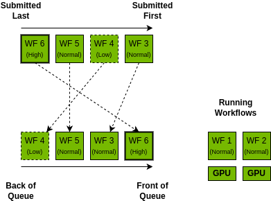
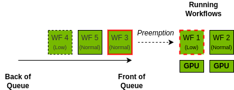
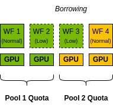
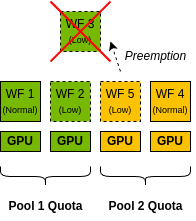

..
  SPDX-FileCopyrightText: Copyright (c) 2025 NVIDIA CORPORATION & AFFILIATES. All rights reserved.

  Licensed under the Apache License, Version 2.0 (the "License");
  you may not use this file except in compliance with the License.
  You may obtain a copy of the License at

  http://www.apache.org/licenses/LICENSE-2.0

  Unless required by applicable law or agreed to in writing, software
  distributed under the License is distributed on an "AS IS" BASIS,
  WITHOUT WARRANTIES OR CONDITIONS OF ANY KIND, either express or implied.
  See the License for the specific language governing permissions and
  limitations under the License.

  SPDX-License-Identifier: Apache-2.0

.. _concepts_priority:

================================================
Priority, Preemption, and Borrowing
================================================

Priority
================================================

If the pool supports preemption, workflows can be assigned one of three priority levels:

..  list-table::
    :header-rows: 1
    :widths: auto

    * - **Priority**
      - **Preemptible**
      - **Can borrow GPUs from other pools**
      - **When to use**
    * - HIGH
      - No
      - No
      - For time-critical workflows that need to skip the queue.
    * - NORMAL
      - No
      - No
      - For most standard workflows.
    * - LOW
      - Yes
      - Yes
      - Batch jobs that can handle being interrupted and restarted. These can be scheduled before
        ``HIGH`` and ``NORMAL`` priority workflows because they can borrow GPUs from other
        pools (see :ref:`concepts_borrowing`).

The scheduler will always try to schedule higher priority workflows before lower priority workflows,
and within the same priority level, workflows are scheduled in the order they are submitted.

In the example below, the workflows are submitted in order from ``WF1`` to ``WF6``.
``WF1`` and ``WF2`` start running immediately because there
are two GPUs available. The rest of the workflows are queued by order of priority and then by
order of submit time.

For more information on how to specify priority, see :ref:`cli_reference_workflow_submit`.

Preemption
================================================

There are no available resources, workflows submitted with the ``LOW`` priority will be preempted
if a higher priority workflow (``NORMAL`` or ``HIGH``) is queued.

The preempted workflow will fail with the ``FAILED_PREEMPTED`` status.

In the example below, ``WF1`` and ``WF2`` are running, and ``WF1`` has ``LOW`` priority.
If ``WF1`` was preempted, then ``WF3`` in the queue would be able to start running, so the scheduler
goes ahead and preempts ``WF1`` to allow ``WF3`` to start.

Preemption allows you to submit as many ``LOW`` priority workflows as you want to keep the cluster
busy without needing to worry about blocking other workflows.

By default, preempted workflows will automatically be rescheduled.
You can manually configure a workflow to automatically reschedule on preemption by using the
``exitActions`` field in the workflow spec. Learn more about exit actions at :ref:`concepts_wf_actions`.

.. note::

  The default behavior for preemption can be configured but requires service-level configuration.
  If you have administrative access, you can enable this directly. Otherwise, contact someone
  with pool administration privileges.

.. _concepts_borrowing:

Borrowing
================================================

Borrowing allows you to run more workflows than you have GPUs given to you, by allowing you to
use GPUs from other pools that are sharing the same physical GPUs.

When sharing GPUs, each pool can have a quota which determines how many GPUs can be occupied by
``NORMAL``/``HIGH`` priority workflows.

However, ``LOW`` priority workflows can go beyond the pool quota by borrowing GPUs from other pools
with the risk of being preempted.

.. note::

  If the pool is under their quota limit, the ``LOW`` priority workflows will **NOT** be preempted
  by **other** pools.

In this example, there are two pools ``pool1`` and ``pool2`` that share 4 GPUs. Both pools
have a quota of 2 GPUs each.

``pool2`` is only using 1 of its 2 allocated GPUs, so ``pool1`` can "borrow" the other GPU from
``pool2`` to run the ``LOW`` priority workflow ``WF3``.

If another workflow, ``WF5``, is submitted to ``pool2`` that needs the borrowed GPU, then the
scheduler will preempt ``WF3`` to allow ``WF5`` to start.

To learn more about how to see your quota and the shared GPUs, see :ref:`cli_reference_pool` and :ref:`cli_reference_resource`.
