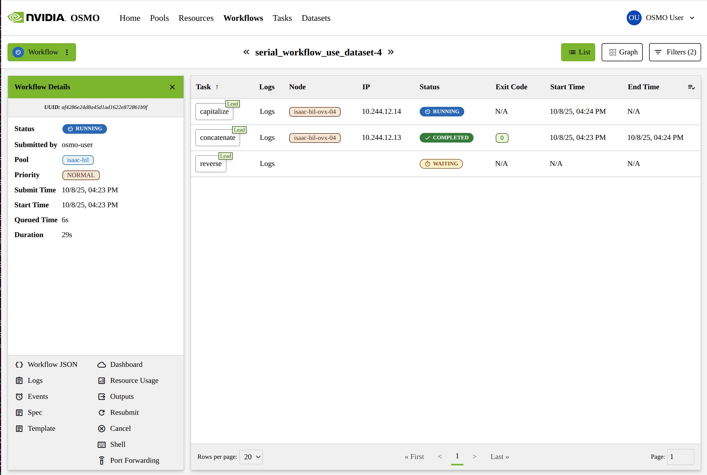
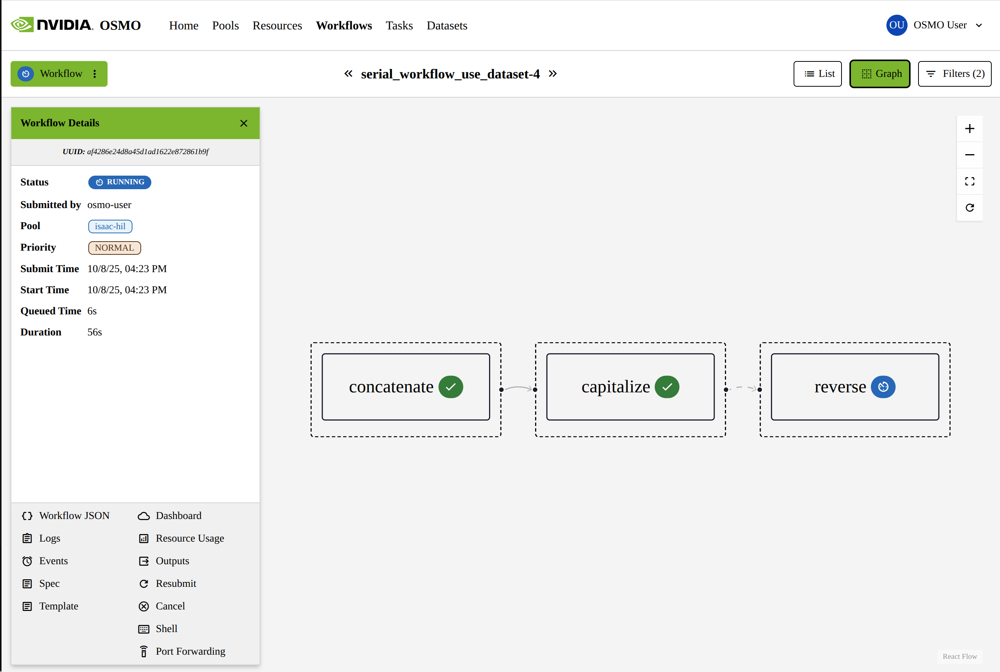

..
  SPDX-FileCopyrightText: Copyright (c) 2025 NVIDIA CORPORATION & AFFILIATES. All rights reserved.

  Licensed under the Apache License, Version 2.0 (the "License");
  you may not use this file except in compliance with the License.
  You may obtain a copy of the License at

  http://www.apache.org/licenses/LICENSE-2.0

  Unless required by applicable law or agreed to in writing, software
  distributed under the License is distributed on an "AS IS" BASIS,
  WITHOUT WARRANTIES OR CONDITIONS OF ANY KIND, either express or implied.
  See the License for the specific language governing permissions and
  limitations under the License.

  SPDX-License-Identifier: Apache-2.0

.. _getting_started_cli:

=============
Using the CLI
=============

Now that you have submitted your first workflow, its time to try out the OSMO CLI.

The CLI allows you to run more advanced use cases, like uploading and downloading datasets from your machine, as well as
submitting workflows that you have checked into source control.

------------------------------------------------
Installing the OSMO CLI
------------------------------------------------

Download the installation script and install the client:

.. code-block:: bash
  :substitutions:

  $ curl -fsSL |osmo_client_install_url| | bash

After running the command above, you will be prompted to authenticate with the following message:

.. code-block:: bash
  :substitutions:

  Installation complete. Logging in...
  Visit |osmo_auth_url|/realms/osmo/device?user_code=GPBO-EKZA and complete authentication.

.. note::

  For more detailed installation instructions, see :ref:`cli_install`.

------------------------------------------------
Setting up data credentials
------------------------------------------------

Now that you have installed the OSMO CLI, you need to set up data credentials.
See which buckets your OSMO instance is configured to use by running the following command:

.. code-block:: bash
  :substitutions:

  $ osmo bucket list

  Bucket           Description      Location                                Mode        Default Cred
  ==================================================================================================
  my_bucket        my bucket        s3://my-bucket-location/some-prefix     read-write  No

Your output may differ, but in this example, OSMO is configured to have one bucket called "my_bucket".
To use this bucket, you will need to create a credential for it. Create a credential with the following command:

.. code-block:: bash

  $ osmo credential set my_bucket --type DATA --payload "access_key_id=<YOUR ACCESS KEY ID>" "access_key=<YOUR ACCESS KEY>" endpoint=s3://my-bucket-location region=us-east-1

.. note::

  For more detailed instructions on setting up data credentials, see :ref:`credentials_data`.

------------------------------------------------
Uploading a dataset
------------------------------------------------

First, lets create a dataset and upload it to the bucket.

.. code-block:: bash

  $ mkdir data
  $ echo 'hello' > data/hello.txt
  $ echo 'world' > data/world.txt
  $ osmo dataset upload my_bucket/my_dataset data

Once the dataset finishes uploading, you can view it by running the dataset list command.

.. code-block:: bash

  $ osmo dataset list --bucket my_bucket
  Bucket      Name         ID                       Created Date             Last Version Created     Last Version   Storage Size   Type
  =========================================================================================================================================
  my_bucket   my_dataset   6f7lWNi1T6iXQpA6g3wlJg   Oct 08, 2025 15:57 EDT   Oct 08, 2025 15:57 EDT   1              12 B           DATASET

.. note::

  For more detailed information on datasets, see :ref:`concepts_ds`.

------------------------------------------------
Using data in a workflow
------------------------------------------------

Now that you have uploaded a dataset, you can use it in a workflow. Copy the following workflow spec into a file called `workflow.yaml`.

.. code-block:: yaml

  workflow:
    name: serial_workflow_use_dataset
    tasks:
    - name: concatenate # (1)
      image: ubuntu:22.04
      command: [bash]
      args:
      - -c
      - |
        PART1=$(cat {{input:0}}/my_dataset/data/hello.txt)
        PART2=$(cat {{input:0}}/my_dataset/data/world.txt)
        echo "$PART1 $PART2" > {{output}}/hello_world.txt
      inputs:
      - dataset:
          name: my_bucket/my_dataset

    # Take the output from the first task and capitalize it
    # Because this task depends on the first task, it will wait for the first task to complete before running
    - name: capitalize # (2)
      image: ubuntu:22.04
      command: [bash]
      args:
      - -c
      - |
        echo "$(cat {{input:concatenate}}/hello_world.txt)" | tr '[:lower:]' '[:upper:]' > {{output}}/hello_world_capitalized.txt
      inputs:
      - task: concatenate # (3)

    # Take the output from the second task and reverse it. Store the output as a new dataset
    # Because this task depends on the second task, it will wait for the second task to complete before running
    - name: reverse # (4)
      image: ubuntu:22.04
      command: [bash]
      args:
      - -c
      - |
        echo "$(cat {{input:capitalize}}/hello_world_capitalized.txt)" | rev > {{output}}/hello_world_capitalized_reversed.txt
      inputs:
      - task: capitalize # (5)
      outputs:
      - dataset:
          name: my_bucket/my_dataset_reversed #(6)

.. code-annotations::

  1. This task concatenates the two files from the dataset and outputs them.
  2. This task takes the output from the first task and capitalizes it.
  3. Because the ``concatenate`` task is an input to the ``capitalize`` task, the ``capitalize`` task will wait for the ``concatenate`` task to complete before it starts.
  4. This task takes the output from the second task and reverses it.
  5. Because the ``capitalize`` task is an input to the ``reverse`` task, the ``reverse`` task will wait for the ``capitalize`` task to complete before it starts.
  6. The output from the ``reverse`` task will be stored as a new dataset.

.. note::

  For more detailed information on workflow specifications, see :ref:`concepts_workflows_tasks_specification`.

Submit the workflow by running the following command. You may need to replace "default" with the name of your pool.
You can use the ``osmo pool list`` command to see a list of your pools (See more at :ref:`cli_reference_pool`).

.. code-block:: bash
  :substitutions:

  $ osmo workflow submit workflow.yaml --pool default
  Workflow submit successful.
  Workflow ID        - serial_workflow_use_dataset-1
  Workflow Overview  - |osmo_url|/workflows/serial_workflow_use_dataset-1

You can follow the "Workflow Overview" link to see the status of your workflow and it's tasks in the OSMO UI.

In the UI, you can also click the "Graph" button on the top right to see a visual representation of the dependencies between the tasks.

Using the workflow Id that was output by the submit command, ``serial_workflow_use_dataset-1``, you can view the logs and status of the workflow from the cli.

To get the status of the workflow, you can use the ``osmo workflow query`` command.

.. code-block:: bash
  :substitutions:

  $ osmo workflow query serial_workflow_use_dataset-1
  Workflow ID : serial_workflow_use_dataset-1
  Status      : COMPLETED
  User        : osmo-user
  Submit Time : Oct 08, 2025 16:23 EDT
  Overview    : |osmo_url|/workflows/serial_workflow_use_dataset-1

  Task Name     Start Time               Status
  ================================================
  capitalize    Oct 08, 2025 16:24 EDT   COMPLETED
  concatenate   Oct 08, 2025 16:23 EDT   COMPLETED
  reverse       Oct 08, 2025 16:24 EDT   COMPLETED

To get the logs of the workflow, you can use the ``osmo workflow logs`` command.
This will output the logs for all of the tasks in the workflow.

.. code-block:: bash
  :substitutions:

  $ osmo workflow logs serial_workflow_use_dataset-1
  Workflow serial_workflow_use_dataset-1 has logs:
  2025/10/08 20:23:43 [concatenate][osmo] Downloading Start
  2025/10/08 20:23:43 [concatenate][osmo] Downloading my_bucket/my_dataset
  2025/10/08 20:23:49 [concatenate][osmo]  50%| 6.00/12.0 [00:03<00:03, 1.60B/s, file_name=datasets-stg/6f7lWNi1T6iXQpA6g3wlJg/hashes/591785b794601e212b260e25925636fd]
  2025/10/08 20:23:49 [concatenate][osmo] 100%| 12.0/12.0 [00:03<00:00, 3.19
  ...
  2025/10/08 20:24:10 [capitalize][osmo] Downloading Start
  2025/10/08 20:24:10 [capitalize][osmo] Downloading concatenate
  2025/10/08 20:24:12 [capitalize][osmo] 100%| 12.0/12.0 [00:01<00:00, 11.9B/s, file_name=serial_workflow_use_dataset-4/concatenate/hello_world.txt]
  2025/10/08 20:24:12 [capitalize][osmo] 100%| 12.0/12.0 [00:01<00:00, 11.8B/s, file_name=serial_workflow_use_dataset-4/concatenate/hello_world.txt]
  2025/10/08 20:24:12 [capitalize][osmo] Data has been downloaded
  ...
  2025/10/08 20:24:33 [reverse][osmo] Downloading Start
  2025/10/08 20:24:33 [reverse][osmo] Downloading capitalize
  2025/10/08 20:24:35 [reverse][osmo] 100%| 12.0/12.0 [00:01<00:00, 7.61B/s, file_name=serial_workflow_use_dataset-4/capitalize/hello_world_capitalized.txt]
  2025/10/08 20:24:35 [reverse][osmo] 100%| 12.0/12.0 [00:01<00:00, 7.59B/s, file_name=serial_workflow_use_dataset-4/capitalize/hello_world_capitalized.txt]
  2025/10/08 20:24:35 [reverse][osmo] Data has been downloaded
  2025/10/08 20:24:36 [reverse][osmo] Downloaded capitalize to {{input:0}}

.. note::

  For more detailed information on the workflow CLI, see :ref:`cli_reference_workflow`.

------------------------------------------------
Downloading the dataset
------------------------------------------------

Now that the workflow has finished running, you can use the OSMO CLI to download the dataset that was created.

.. code-block:: bash

  $ osmo dataset download my_bucket/my_dataset_reversed .
  $ cat my_dataset_reversed/hello_world_capitalized_reversed.txt
  DLROW OLLEH

------------------------------------------------
What's Next
------------------------------------------------

* Read more in depth about workflows: :ref:`concepts_wf`
* Read more in depth about datasets: :ref:`concepts_ds`
* Read additional documentation on the OSMO CLI: :ref:`cli_reference`
* See additional tutorials with more advanced use cases: :ref:`Tutorials <tutorials>`
