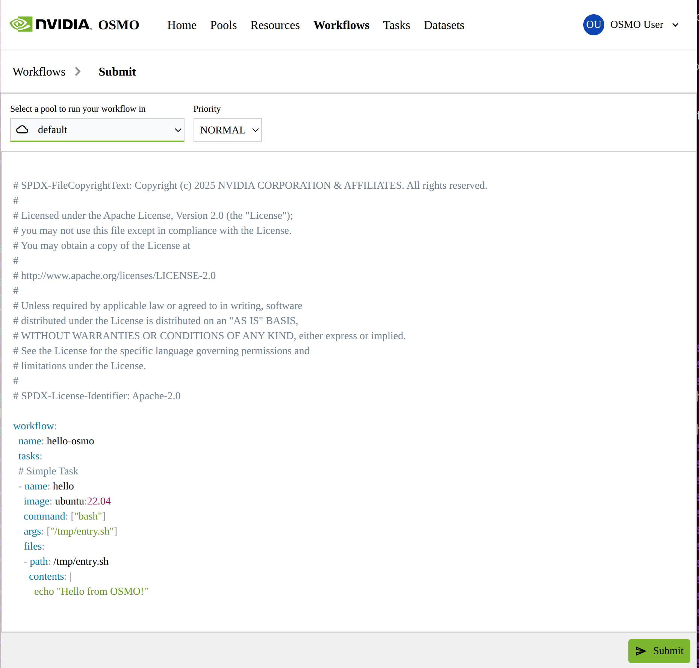
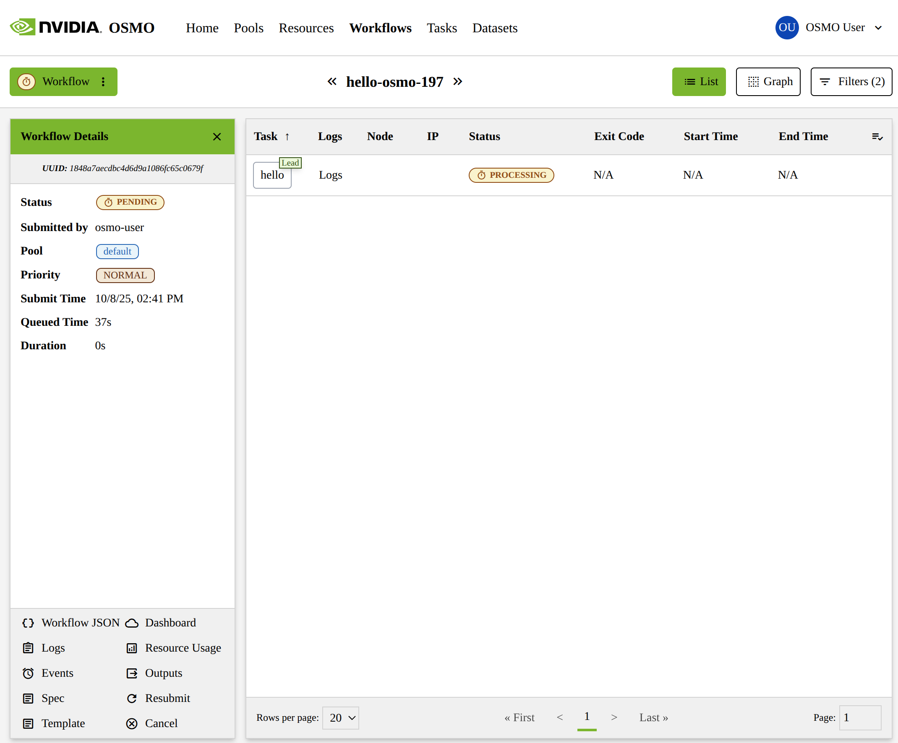
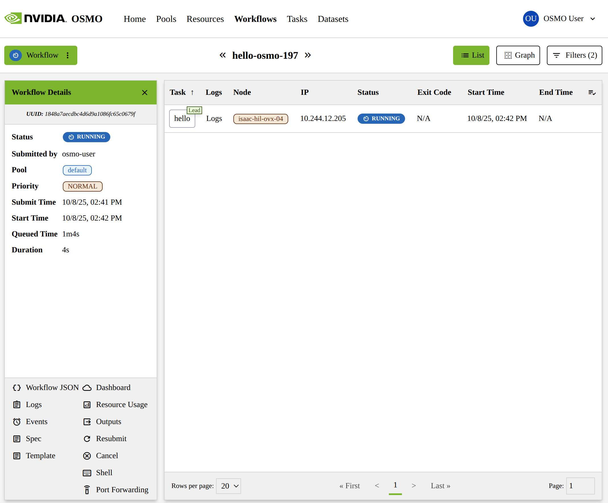
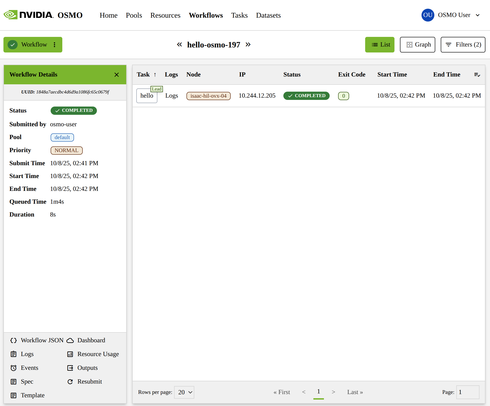
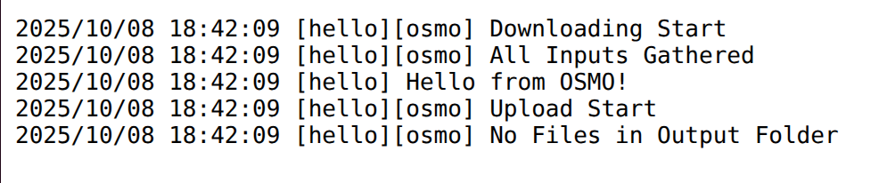

..
  SPDX-FileCopyrightText: Copyright (c) 2025 NVIDIA CORPORATION & AFFILIATES. All rights reserved.

  Licensed under the Apache License, Version 2.0 (the "License");
  you may not use this file except in compliance with the License.
  You may obtain a copy of the License at

  http://www.apache.org/licenses/LICENSE-2.0

  Unless required by applicable law or agreed to in writing, software
  distributed under the License is distributed on an "AS IS" BASIS,
  WITHOUT WARRANTIES OR CONDITIONS OF ANY KIND, either express or implied.
  See the License for the specific language governing permissions and
  limitations under the License.

  SPDX-License-Identifier: Apache-2.0

.. _getting_started_ui:

================
Using the Web UI
================

The easiest way to get started with submitting workflows to OSMO is to use the Web UI. This section will walk you through using the Web UI to
submit your first workflow to OSMO and to track its progress as it runs.

The recommended web browsers are Google Chrome or Microsoft Edge.

Navigate to the URL for your OSMO instance in your web browser.

At the top of the web UI, navigate to the "Workflows" tab.

Here you will see a list of your recently submitted workflows. At the top right, there will be a link to "Submit a Workflow". Follow this link.

.. image:: ui_submit_workflow_link.png
  :alt: OSMO Web UI submit workflow link
  :align: center

This will take you to a page where you can submit a workflow spec. Here you will see:

* A dropdown menu to select which pool to submit your workflow to, from a list of pools you have access to. (See more about pools :ref:`concepts_pools`)
* A dropdown menu to select which priority to submit your workflow with, from a list of priorities. (See more about priorities :ref:`concepts_priority`)
* A text area to paste in your workflow spec (See more about workflow specs :ref:`concepts_workflows_tasks_specification`).

For now, we can use the pool, priority, and workflow spec that are already filled out. Click the "Submit" button.

This will take you to the workflow details page where you can watch your workflow run. You can watch the workflow progress from "PROCESSING" to "RUNNING", and finally to "COMPLETED".

You can click the "Logs" button to view the logs of the "hello" task from the workflow. You can view the logs of a workflow in real time while its running, or after it has finished.

