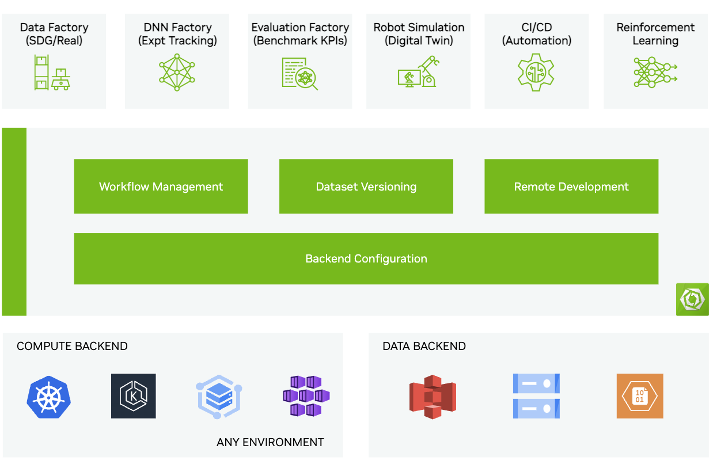

..
  SPDX-FileCopyrightText: Copyright (c) 2025 NVIDIA CORPORATION & AFFILIATES. All rights reserved.

  Licensed under the Apache License, Version 2.0 (the "License");
  you may not use this file except in compliance with the License.
  You may obtain a copy of the License at

  http://www.apache.org/licenses/LICENSE-2.0

  Unless required by applicable law or agreed to in writing, software
  distributed under the License is distributed on an "AS IS" BASIS,
  WITHOUT WARRANTIES OR CONDITIONS OF ANY KIND, either express or implied.
  See the License for the specific language governing permissions and
  limitations under the License.

  SPDX-License-Identifier: Apache-2.0

===================
OSMO User Guide
===================

Welcome to OSMO, a cloud native platform for Robotics developers.

* Onboard with :doc:`Getting Started </getting_started/index>` to OSMO.
* Review :doc:`Tutorials </tutorials/index>` to run sample workflows.
* Scan through the :doc:`FAQs </faq/index>` for answers to common questions.
* Refer to :doc:`Troubleshooting </troubleshooting/index>` to debug issues.

.. toctree::
  :hidden:
  :caption: Introduction

  overview/index

.. toctree::
  :hidden:
  :caption: Getting Started

  getting_started/index
  getting_started/getting_started_ui
  getting_started/getting_started_cli

.. toctree::
  :hidden:
  :caption: Concepts

  concepts/index
  concepts/resources_pools_platforms/index
  concepts/workflows_tasks/index
  concepts/datasets/index
  concepts/apps/index

.. toctree::
  :hidden:
  :caption: Settings

  settings/credentials/index
  settings/access_token
  settings/notifications/index

.. toctree::
  :hidden:
  :caption: Tutorials

  tutorials/index
  tutorials/osmo_in_20
  tutorials/sdg_in_60
  tutorials/hil_in_60
  tutorials/training
  tutorials/groot

.. toctree::
  :hidden:

  workflow_examples/index
  faq/index
  troubleshooting/index

.. toctree::
  :hidden:
  :caption: Reference

  reference/cli/index
