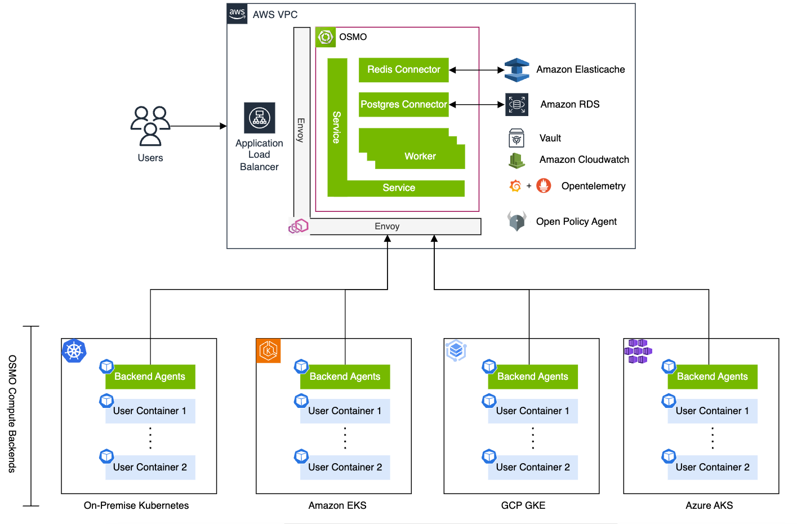

..
  SPDX-FileCopyrightText: Copyright (c) 2025 NVIDIA CORPORATION & AFFILIATES. All rights reserved.

  Licensed under the Apache License, Version 2.0 (the "License");
  you may not use this file except in compliance with the License.
  You may obtain a copy of the License at

  http://www.apache.org/licenses/LICENSE-2.0

  Unless required by applicable law or agreed to in writing, software
  distributed under the License is distributed on an "AS IS" BASIS,
  WITHOUT WARRANTIES OR CONDITIONS OF ANY KIND, either express or implied.
  See the License for the specific language governing permissions and
  limitations under the License.

  SPDX-License-Identifier: Apache-2.0

:hide-toc:

.. _overview:

What is OSMO?
=============

NVIDIA OSMO is a flexible GPU and storage orchestration platform that serves as a single interface for all steps of the AI and robotics development process.

Developing a working solution from start to finish, especially for robotics, is often much more than just running distributed training for an AI model.
OSMO is designed from the ground up to support all sorts of complex workloads with diverse hardware requirements, such as:

* Synthetic data generation
* Data parallel reinforcement learning
* Data, tensor, and pipeline parallel training
* Simulation with hardware in the loop
* Data transformation and processing
* Sensor driver validation with real hardware
* Interactive development

Why OSMO?
---------

OSMO aims to provide a single interface for managing all of your compute, managing all of your storage, and enabling you to run all of your workflows.

All of your compute
~~~~~~~~~~~~~~~~~~~

Any compute in the form of a Kubernetes cluster can be connected to OSMO. Scale up massively with a cloud provisioned kubernetes cluster like AKS, EKS, or GKE.
Leverage compute you have on premise with a bare metal kubernetes cluster. Add embedded machines like NVIDIA Jetson, or even a stationary robot chassis, to enable hardware-in-loop testing and simulation.

OSMO leverages the NVIDIA Run:AI scheduler to efficiently share resources across your team while making sure that your GPUs stay busy.

All of your storage
~~~~~~~~~~~~~~~~~~~

OSMO allows any S3-compatible object storage, as well as Azure Blob Storage, to be connected and managed with OSMO Datasets.
Datasets let you store data and models in a version controlled manner. Content addressable storage is used to de-duplicate
data that is repeated across multiple versions of a dataset to reduce storage costs and speed up data upload and download.

All of your workflows
~~~~~~~~~~~~~~~~~~~~~

Complex workflows with multiple compute nodes are reduced to YAML "recipes" that are:

* Easy to write and share
* Templated to allow for easy reuse and scaling
* Reproducible

See more in the :ref:`concepts_wf` section.

.. image:: wf_lifecycle.gif
	:width: 800
	:alt: OSMO Workflow Lifecycle
	:align: center

----

Getting OSMO
============

To try out OSMO quickly, visit our `Quick Start guide <https://github.com/NVIDIA/OSMO/blob/main/QUICK_START.md>`_.

For a full, production-ready deployment, see one the following guides:

* `Azure <https://github.com/NVIDIA/OSMO/tree/main/deployments/terraform/azure/example>`_
* `AWS <https://github.com/NVIDIA/OSMO/tree/main/deployments/terraform/aws/example>`_

----

Using OSMO
==========

OSMO supports a :ref:`CLI client <cli_install>` and `web UI <osmo_ui_>`_.

Go to the :ref:`Getting Started <getting_started>` section to learn more.
