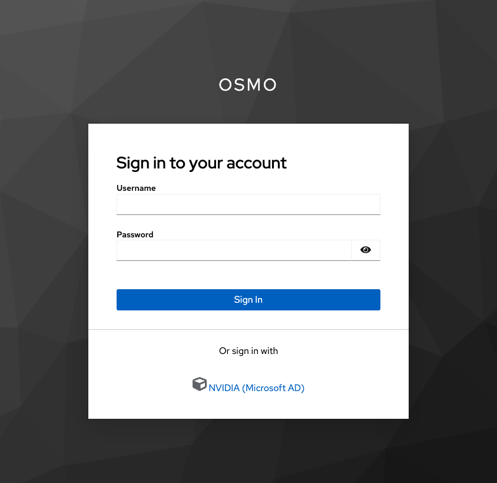
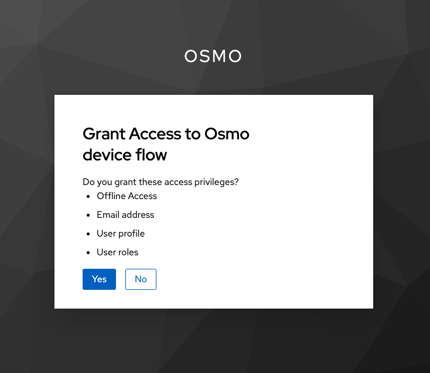

..
  SPDX-FileCopyrightText: Copyright (c) 2025 NVIDIA CORPORATION & AFFILIATES. All rights reserved.

  Licensed under the Apache License, Version 2.0 (the "License");
  you may not use this file except in compliance with the License.
  You may obtain a copy of the License at

  http://www.apache.org/licenses/LICENSE-2.0

  Unless required by applicable law or agreed to in writing, software
  distributed under the License is distributed on an "AS IS" BASIS,
  WITHOUT WARRANTIES OR CONDITIONS OF ANY KIND, either express or implied.
  See the License for the specific language governing permissions and
  limitations under the License.

  SPDX-License-Identifier: Apache-2.0

.. _cli_install:

===================
System Requirements
===================

* Operating System
    * Ubuntu 22.04+ (x86_64)
    * MacOS (arm64)
* CPU: 1
* Disk: 500 MB
* Memory: 1 GB

================================================
Install
================================================

Download the installation script and install the client:

.. code-block:: bash
  :substitutions:

  $ curl -fsSL |osmo_client_install_url| | bash

After running the command above, you will be prompted to authenticate with the following message:

.. code-block:: bash
  :substitutions:

  Installation complete. Logging in...
  Visit |osmo_auth_url|/realms/osmo/device?user_code=HIIV-ECOD and complete authentication.

Follow the prompts that lead to the browser based OIDC authentication.

Grant access for OSMO application to authenticate you.

After successful authentication, you are logged in. Welcome to OSMO.

.. image:: login3.png
  :alt: Alternative text

.. code-block:: bash
  :class: no-copybutton

  Successfully logged in. Welcome <Your Full Name>.

.. note::

  To install the client in non-interactive mode, use the following command:

  .. code-block:: bash
    :substitutions:

    $ curl -fsSL |osmo_client_install_url| | sudo bash -s -- -y

Login
------

To login to the client, can use the following command:

.. code-block:: bash
  :substitutions:

  $ osmo login |osmo_url|

  Successfully logged in. Welcome <Your ID>.

Logout
------

To logout from the client, can use the following command:

.. code-block:: bash

  $ osmo logout

  Successfully logged out.

Update
------

Some client updates are optional and some are mandatory. The client will let you know when it is time to update.

.. code-block:: bash
  :substitutions:

  $ osmo dataset list

  2025-10-03T11:15:45.464-07:00 client [ERROR] client: Server responded with status code 400
  Error message: Your client is out of date. Client version is 1.0.0 but the newest client version is 2.0.0. Please run the following command:
  curl -fsSL |osmo_client_install_url| | bash

================================================
Uninstall
================================================

To uninstall the client, run the following command:

.. code-block:: bash

  $ sudo rm -rf /usr/local/bin/osmo /usr/local/osmo
