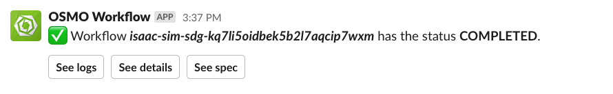
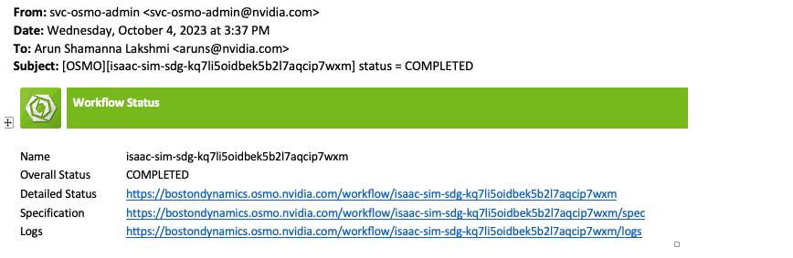

..
  SPDX-FileCopyrightText: Copyright (c) 2025 NVIDIA CORPORATION & AFFILIATES. All rights reserved.

  Licensed under the Apache License, Version 2.0 (the "License");
  you may not use this file except in compliance with the License.
  You may obtain a copy of the License at

  http://www.apache.org/licenses/LICENSE-2.0

  Unless required by applicable law or agreed to in writing, software
  distributed under the License is distributed on an "AS IS" BASIS,
  WITHOUT WARRANTIES OR CONDITIONS OF ANY KIND, either express or implied.
  See the License for the specific language governing permissions and
  limitations under the License.

  SPDX-License-Identifier: Apache-2.0

.. _notifications:

================================================
Notifications
================================================

Manage notification preferences (Slack, Email) and defaults (bucket, pool) with the profile CLI.

Viewing Current Settings
------------------------

You can use the :ref:`Profile List CLI command <cli_reference_profile_list>` to view your current profile, including notification preferences and defaults.

.. code-block:: bash

  $ osmo profile list
  user:
    name: John Doe
    email: jdoe@nvidia.com
  notifications:
    email: False
    slack: True
  bucket:
    default: my-bucket
  pool:
    default: my-pool
    accessible:
    - my-pool
    - team-pool

Configuring Notifications
-------------------------

Use the :ref:`Profile Set CLI command <cli_reference_profile>` to enable or disable notification channels.

By default, ``slack`` notifications are enabled and ``email`` notifications are disabled.

.. code-block:: bash

  $ osmo profile set notifications email true
  $ osmo profile set notifications slack false

Example notification UIs:

**Slack**:

.. note::

  Slack will only work if the admin has set the Slack token.

**Email**:

.. note::

  Email will only work if the admin has configured the email SMTP server.

Setting Default Bucket
----------------------

To choose a default bucket, first view available buckets with the :ref:`Bucket List CLI command <cli_reference_bucket>`.

.. code-block:: bash

  $ osmo bucket list

  Bucket                Location
  ===========================================
  my_bucket             s3://<name_of_bucket>

Set the default bucket using the profile CLI.

.. code-block:: bash

  $ osmo profile set bucket my_bucket

Setting Default Pool (Optional)
-------------------------------

To choose a default pool, use the :ref:`Profile List CLI command <cli_reference_profile_list>` to view available pools and :ref:`Resource List CLI command <cli_reference_resource_list>` to see what resources are in each pool.

Set the default pool using the profile CLI.

.. code-block:: bash

  $ osmo profile set pool my_pool
