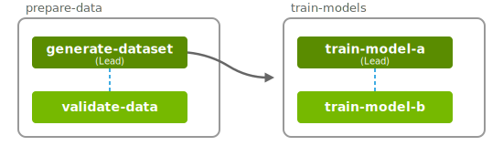
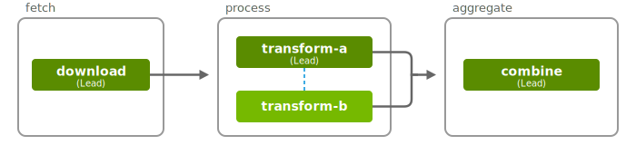

..
  SPDX-FileCopyrightText: Copyright (c) 2025 NVIDIA CORPORATION & AFFILIATES. All rights reserved.

  Licensed under the Apache License, Version 2.0 (the "License");
  you may not use this file except in compliance with the License.
  You may obtain a copy of the License at

  http://www.apache.org/licenses/LICENSE-2.0

  Unless required by applicable law or agreed to in writing, software
  distributed under the License is distributed on an "AS IS" BASIS,
  WITHOUT WARRANTIES OR CONDITIONS OF ANY KIND, either express or implied.
  See the License for the specific language governing permissions and
  limitations under the License.

  SPDX-License-Identifier: Apache-2.0

.. _tutorials_combination_workflows:

=====================
Combination Workflows
=====================

This tutorial teaches you how to combine serial and parallel execution patterns by creating
**groups with dependencies**—enabling sophisticated multi-stage workflows.

So far, you have learned:

- **Serial workflows** (:ref:`Tutorial #5 <tutorials_serial_workflows>`) - Tasks run one after another with dependencies
- **Parallel workflows** (:ref:`Tutorial #6 <tutorials_parallel_workflows>`) - Tasks run simultaneously using groups

**Combination workflows** merge both patterns by creating **groups with dependencies**.

By the end, you'll understand:

- How to create workflows with groups that depend on each other
- How data flows between groups
- How to build complex multi-stage pipelines

.. tip::

  Combination workflows are ideal for:

  - **Data processing pipelines** - Preprocess → train/validate in parallel → aggregate
  - **ML workflows** - Data prep → train multiple models → compare results
  - **Testing workflows** - Build → test on multiple configs → report
  - **ETL pipelines** - Extract → transform in parallel → load

Simple Example
==============

Let's build a data processing pipeline with multiple stages by downloading the workflow definition
here: :download:`combination_workflow_simple.yaml <combination_workflow_simple.yaml>`.

.. literalinclude:: combination_workflow_simple.yaml
  :language: yaml
  :start-after: SPDX-License-Identifier: Apache-2.0

.. code-annotations::

  1. The ``generate-dataset`` task is an input task for the ``train-model-a`` task. Therefore,
     the entire group ``train-models`` waits for ``prepare-data`` to complete.

**Execution Flow:**

1. Group ``prepare-data`` starts → ``generate-dataset`` and ``validate-data`` run in parallel.
2. Task ``generate-dataset`` completes → Group ``train-models`` dependencies are satisfied.
3. Group ``train-models`` starts → ``train-model-a`` and ``train-model-b`` run in parallel.

.. important::

  **Group dependencies** are established through **task dependencies**.

  If any task in a group depends on a task from another group, the entire group waits for the other
  group to complete.

**Key Characteristics:**

- ✅ Serial execution **between** groups
- ✅ Parallel execution **within** groups
- ✅ Data flows from Group 1 to Group 2
- ✅ All tasks access the same data from the previous group

Complex Example
===============

Let's build a more complex data processing pipeline by downloading the workflow definition
here: :download:`combination_workflow_complex.yaml <combination_workflow_complex.yaml>`.

.. literalinclude:: combination_workflow_complex.yaml
  :language: yaml
  :start-after: SPDX-License-Identifier: Apache-2.0

.. code-annotations::

  1. The ``transform-a`` task is intentionally longer than the ``transform-b`` task to ensure that
     the ``lead`` task doesn't prematurely terminate non-lead tasks.
  2. Group 3 depends on both tasks from Group 2, so it waits for Group 2 to complete.

**Execution:**

1. Group ``fetch`` starts → ``download`` task runs
2. ``download`` task completes → Group ``process`` dependencies are satisfied.
3. Group ``process`` starts → ``transform-a`` and ``transform-b`` run in parallel.
4. ``transform-b`` task completes → Group ``aggregate`` dependencies not yet satisfied.
5. ``transform-a`` task completes → Group ``aggregate`` dependencies are satisfied.
6. Group ``aggregate`` starts → ``combine`` task runs with outputs from both transforms.

.. caution::

   To ensure that **all tasks** in a group run to completion, you should make sure that
   the ``lead`` task **does not terminate** before non-lead tasks.

   This can be done by coordinating task completion through a barrier script
   (`osmo_barrier.py <https://github.com/NVIDIA/OSMO/tree/main/workflows/dnn_training/torchrun_multinode/osmo_barrier.py>`_)
   or by ensuring that the ``lead`` task duration is longer than the non-lead tasks.

.. important::

  **Best Practices:**

  - ✅ Always designate one task as ``lead: true`` in each group
  - ✅ Use clear group names that reflect their purpose (e.g., ``prepare-data``, ``train-models``)
  - ✅ Make dependencies explicit through task inputs
  - ✅ Consider which tasks should run in parallel vs. serially

Next Steps
==========

**Continue Learning:**

- :ref:`Gang Scheduling <tutorials_gang_scheduling>` - Run tasks across different hardware platforms (x86, ARM, GPU) simultaneously
- :ref:`Advanced Patterns <tutorials_advanced_patterns>` - Workflow templates, checkpointing, error handling, and more

.. seealso::

  **Related Documentation:**

  - :ref:`Groups <workflow_spec_group>` - Full specification for groups
  - :ref:`Inputs and Outputs <workflow_spec_inputs_and_outputs>` - Data flow between tasks
