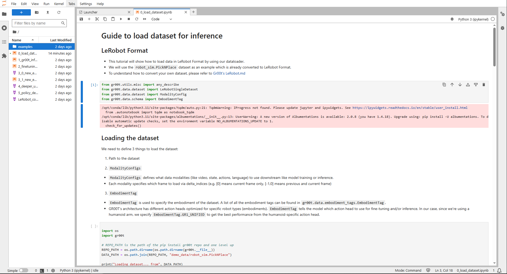

..
  SPDX-FileCopyrightText: Copyright (c) 2025 NVIDIA CORPORATION & AFFILIATES. All rights reserved.

  Licensed under the Apache License, Version 2.0 (the "License");
  you may not use this file except in compliance with the License.
  You may obtain a copy of the License at

  http://www.apache.org/licenses/LICENSE-2.0

  Unless required by applicable law or agreed to in writing, software
  distributed under the License is distributed on an "AS IS" BASIS,
  WITHOUT WARRANTIES OR CONDITIONS OF ANY KIND, either express or implied.
  See the License for the specific language governing permissions and
  limitations under the License.

  SPDX-License-Identifier: Apache-2.0

.. _groot:

================================================
Inference and Fine-tuning with Isaac Groot
================================================

Introduction
------------

This workflow demonstrates how to perform inference and fine-tuning using `Isaac Groot <https://research.nvidia.com/labs/gear/gr00t-n1_5/>`_
through a Jupyter notebook.

This tutorial is for users who want to experiment with the Isaac Groot foundation models and libraries, and fine-tune it for their own use cases.

Overview
--------

The workflow consists of:

- A JupyterLab interface
- All of the Isaac Groot tutorial Jupyter notebooks that feature fine-tuning and inference

Interacting with the Workflow
-----------------------------

Fetch the workflow spec:

.. code-block:: bash

    $ curl -O https://raw.githubusercontent.com/NVIDIA/OSMO/main/workflow_examples/groot/groot.yaml

.. note::

    The complete workflow example is available `here <https://github.com/NVIDIA/OSMO/tree/main/workflow_examples/groot>`_.

Add any platform value if necessary. After that, submit the workflow:

.. code-block:: bash

    $ osmo workflow submit groot.yaml

After the workflow starts running, check the logs to see if the workflow logs this messages:

.. code-block:: bash

   Jupyter Server 2.17.0 is running at:
     http://259979d2baca4df3-6f6754cdce454168:6060/lab
     http://127.0.0.1:6060/lab
   Use Control-C to stop this server and shut down all kernels (twice to skip confirmation).

Before the workflow logs this message, the workflow is installing all the necessary dependencies
before spinning up the JupyterLab interface.

Then, you can access the JupyterLab interface by running the following command:

.. code-block:: bash

  $ osmo workflow port-forward <workflow ID> tutorial --port 6060

Navigate to http://localhost:6060 in your browser.
On the left hand side, you can see the list of all the tutorial notebooks.

When running the executable boxes, you can oftentimes see visualizations directly
in the notebook:

.. image:: images/groot_action.png
  :width: 800
  :align: center

When running the notebooks, there are sections that require you to run Python scripts outside the notebook.
For example, in the `Fine-tuning` notebook, you will see something like this:

.. image:: images/finetune_notebook.png
  :width: 800
  :align: center

Notice that the Python script is not there as an executable box.
You will need to run the Python script outside the notebook.

To run Python scripts like these, you can create an exec session, and run the scripts there instead:

.. code-block:: bash

  $ osmo workflow exec <workflow ID> tutorial --entry /bin/bash

Once you are in the exec session, you can go into the right directory:

.. code-block:: bash

  $ cd Isaac-GR00T

And then run the Python scripts:

.. code-block:: bash

  $ python scripts/gr00t_finetune.py \
    --dataset-path ./demo_data/robot_sim.PickNPlace \
    --num-gpus 1 \
    --max-steps 500 \
    --output-dir /tmp/gr00t-1/finetuned-model \
    --data-config gr1_arms_only

You can keep the exec session open and run multiple scripts as outlined in later notebooks,
especially in the `New Embodiment Fine-tuning` notebook.
