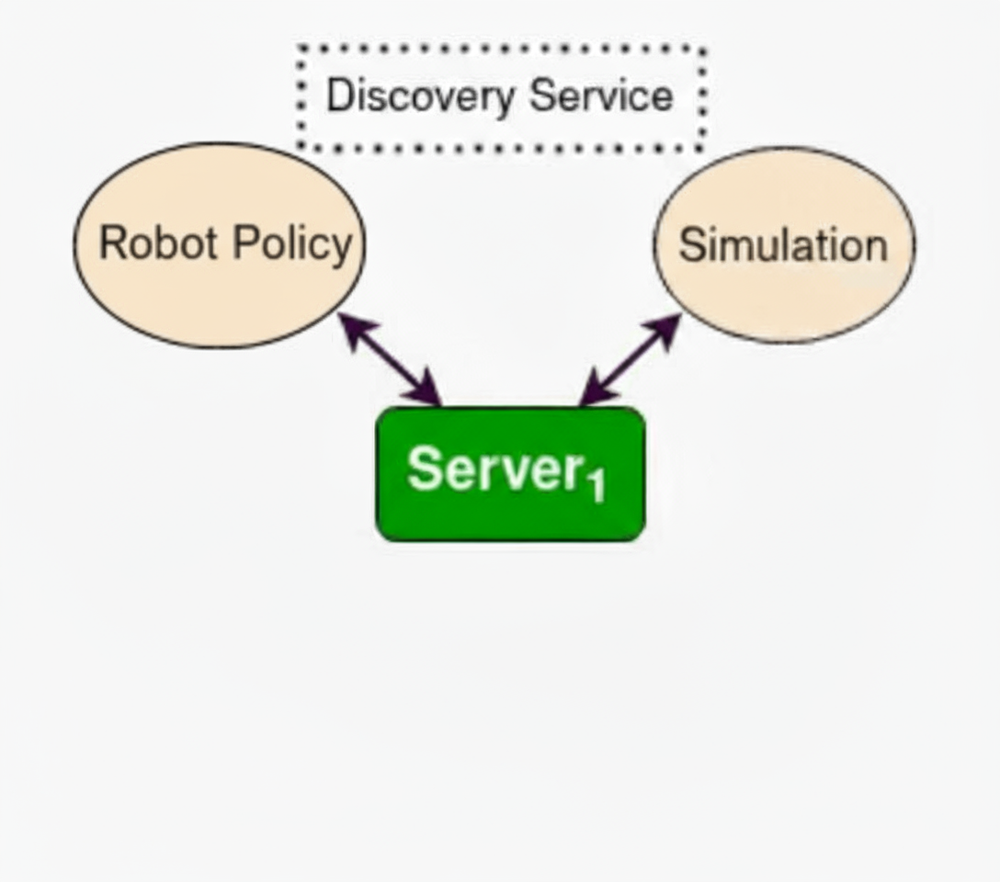
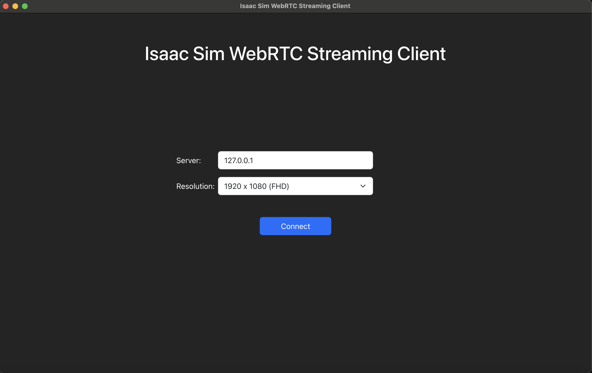
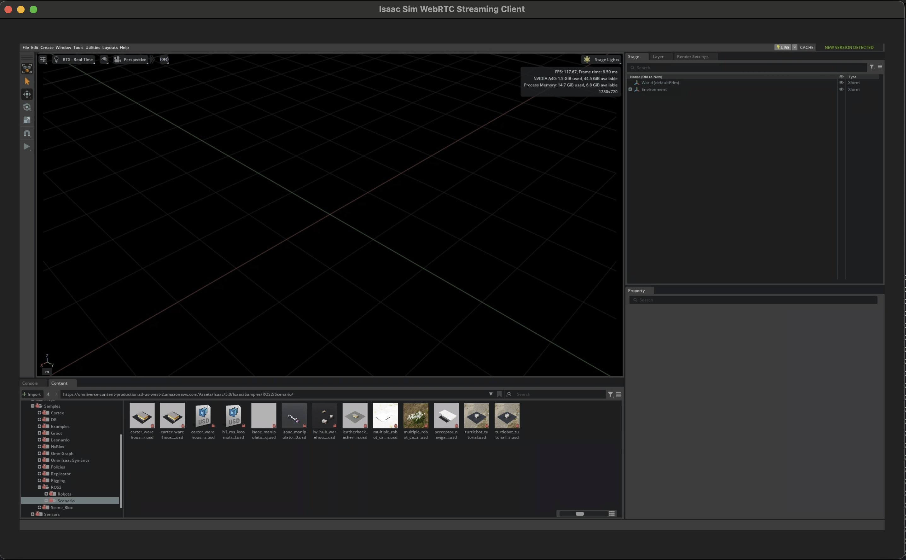
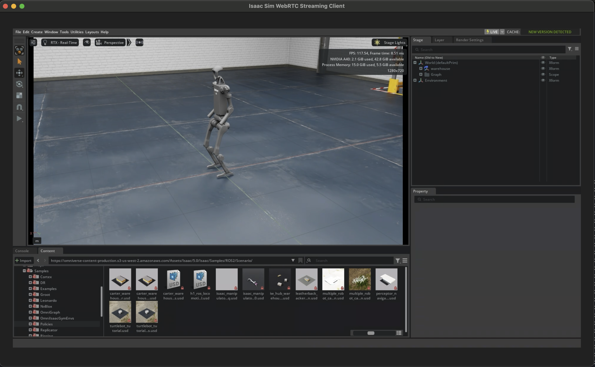

..
  SPDX-FileCopyrightText: Copyright (c) 2025 NVIDIA CORPORATION & AFFILIATES. All rights reserved.

  Licensed under the Apache License, Version 2.0 (the "License");
  you may not use this file except in compliance with the License.
  You may obtain a copy of the License at

  http://www.apache.org/licenses/LICENSE-2.0

  Unless required by applicable law or agreed to in writing, software
  distributed under the License is distributed on an "AS IS" BASIS,
  WITHOUT WARRANTIES OR CONDITIONS OF ANY KIND, either express or implied.
  See the License for the specific language governing permissions and
  limitations under the License.

  SPDX-License-Identifier: Apache-2.0

.. _hil_in_60:

=================================================
Hardware-in-the-Loop (HIL) in 60 Minutes
=================================================

Introduction
------------

This workflow demonstrates how to run *hardware-in-the-loop (HIL)* using ROS2 on an embedded system (i.e. Jetson Orin) and
running simulation using Isaac Lab on a separate machine with a desktop GPU.

This tutorial is for users who want to implement their own HIL workflows, especially in an environment where the embedded
device is not on the same LAN/subnet as the simulation machine.
Users are also expected to be familiar with basic concepts of ROS2 and its middleware.

The main objective of this tutorial is to demonstrate how to configure the ROS2 Discovery Server to allow the embedded
system to communicate with the simulation machine.

Prerequisites
-------------

To livestream a headless instance of Isaac Sim, you need to install the livestream client to your local machine.
Refer to the official Isaac Sim `Installation <https://docs.isaacsim.omniverse.nvidia.com/5.0.0/installation/manual_livestream_clients.html>`_ for more details.

To learn some fundamental concepts regarding the ROS2 Discovery Server, review the guide from the
`official documentation <https://docs.ros.org/en/humble/Tutorials/Advanced/Discovery-Server/Discovery-Server.html>`_.

Overview
--------

This HIL workflow will have the following tasks:

- Robot Policy
- Simulation
- Discovery Server

The robot policy is the controller that will determine the robot's movement.
This will run on the embedded system.

The simulation is the Isaac Lab instance that will run the simulation that includes a humanoid robot.
The robot policy task will be controlling the movements of that robot.
This will run on a machine with a desktop GPU.

The discovery server is the server that will route the messages between the robot policy and the simulation.
This can run on any x86_64 machine (does not need a GPU).

Setting up Communication Protocol
---------------------------------

In this section, we will discuss the configuration files that are needed to set up the communication protocol for
ROS2 messages to be routed between the embedded system and the simulation machine.

These files will be mounted into the the tasks running the robot policy and the Isaac Lab instance.

We will first create the ``rtps_udp_profile.xml`` file.
This file defines a DDS transport profile that explicitly configures UDP
communication for ROS 2 nodes using the RTPS (Real-Time Publish Subscribe) protocol.

.. code-block:: xml

  <profiles xmlns="http://www.eprosima.com/XMLSchemas/fastRTPS_Profiles" >
      <transport_descriptors>
          <!-- (1) -->
          <transport_descriptor>
              <transport_id>UdpTransport</transport_id>
              <type>UDPv4</type>
          </transport_descriptor>
      </transport_descriptors>

      <participant profile_name="udp_transport_profile" is_default_profile="true">
          <rtps>
              <userTransports>
                  <transport_id>UdpTransport</transport_id>
              </userTransports>
              <!-- (2) -->
              <useBuiltinTransports>false</useBuiltinTransports>
          </rtps>
      </participant>
  </profiles>

.. code-annotations::

  1. Set the transport to UDPv4, meaning that UDP and IPv4 are only used for communication.
  2. ROS2's built-in transports assumes that both the sender and receiver are on the same machine,
     and uses shared memory for communication. Since this assumption is false for our case, we need to
     explicitly set the useBuiltinTransports to false.

Then we will create the ``discovery_server_config.xml`` file.
This file configures a DDS (Data Distribution Service) participant to
act as a client that connects to a centralized discovery server for ROS2 communication.

.. code-block:: xml

  <dds>
    <profiles xmlns="http://www.eprosima.com/XMLSchemas/fastRTPS_Profiles">
        <participant profile_name="super_client_profile" is_default_profile="true">
            <rtps>
                <builtin>
                    <discovery_config>
                        <!-- (1) -->
                        <discoveryProtocol>CLIENT</discoveryProtocol>
                        <discoveryServersList>
                            <!-- (2) -->
                            <RemoteServer prefix="44.53.00.5f.45.50.52.4f.53.49.4d.41">
                                <metatrafficUnicastLocatorList>
                                    <locator>
                                        <udpv4>
                                            <address>DISCOVERY_SERVER_IP</address>
                                            <port>11811</port>
                                        </udpv4>
                                    </locator>
                                </metatrafficUnicastLocatorList>
                            </RemoteServer>
                        </discoveryServersList>
                    </discovery_config>
                    <!-- (3) -->
                    <metatrafficUnicastLocatorList>
                        <locator>
                            <udpv4>
                                <address>CURRENT_MACHINE_PUBLIC_IP</address>
                                <port>7778</port>
                            </udpv4>
                        </locator>
                    </metatrafficUnicastLocatorList>
               </builtin>
                    <!-- (4) -->
                    <defaultUnicastLocatorList>
                        <locator>
                            <udpv4>
                                <address>CURRENT_MACHINE_PUBLIC_IP</address>
                                <port>7777</port>
                            </udpv4>
                        </locator>
                    </defaultUnicastLocatorList>
            </rtps>
        </participant>
    </profiles>
  </dds>

.. code-annotations::

  1. Sets the discovery protocol to CLIENT, meaning that the DDS participant will act as a client that connects to a centralized discovery server for ROS2 communication.
  2. This section defines the discovery server, and which IP and port to reach out to. This IP value will be populated by the setup_dds.sh script.
  3. By defining unicast, this disables the default multicast-based “simple discovery,” ensuring that all discovery flows through the server, and constraining traffic to chosen interfaces and ports.
     This IP value will be populated by the setup_dds.sh script.
  4. This defines the default unicast listening address/port for data messages and what gets advertised to peers for user-data paths.

After that, we will create the ``setup_dds.sh`` script.
This script will resolve the IP of the discovery server and populate the IPs in the discovery server config file.

.. code-block:: bash

  set -x +e
  sudo apt update
  # set noninteractive installation
  export DEBIAN_FRONTEND=noninteractive
  # install tzdata package
  apt-get install -y tzdata
  # set timezone
  ln -fs /usr/share/zoneinfo/America/Los_Angeles /etc/localtime
  dpkg-reconfigure --frontend noninteractive tzdata
  sudo apt install -y net-tools netcat dnsutils

  NAT_INTERFACE=eth0
  NAT_IP=$(ifconfig "$NAT_INTERFACE" | grep -oP "inet \K\d{1,3}\.\d{1,3}\.\d{1,3}\.\d{1,3}")  # (1)

  DISCOVERY_SERVER_IP=$(nslookup {{host:discovery-server}} | grep -oP \
      'Address: \K\d[0-9]{1,3}\.[0-9]{1,3}\.[0-9]{1,3}\.[0-9]{1,3}')   # (2)

  while [[ $DISCOVERY_SERVER_IP == "" ]] ; do
      sleep 10
      DISCOVERY_SERVER_IP=$(nslookup {{host:discovery-server}} | grep -oP \
      'Address: \K\d[0-9]{1,3}\.[0-9]{1,3}\.[0-9]{1,3}\.[0-9]{1,3}')   # (3)
  done

  # Add in IP information in discovery server config
  sudo cp /workspaces/config/mounted_discovery_server_config.xml \
      /workspaces/config/discovery_server_config.xml
  DDS_CONFIG_XML_PATH=/workspaces/config/discovery_server_config.xml
  sudo sed -i "s/DISCOVERY_SERVER_IP/$DISCOVERY_SERVER_IP/g" $DDS_CONFIG_XML_PATH   # (4)
  sudo sed -i "s/CURRENT_MACHINE_PUBLIC_IP/$NAT_IP/g" $DDS_CONFIG_XML_PATH

  # Add env variables
  export ROS_DISCOVERY_SERVER=$DISCOVERY_SERVER_IP:11811
  export FASTRTPS_DEFAULT_PROFILES_FILE=$DDS_CONFIG_XML_PATH

.. code-annotations::

  1. Use nslookup to get the IP of the machine running this script.
  2. The token '{{host:discovery-server}}' is an OSMO token that will be resolved into
     the subdomain name of the discovery server.
     The script will use nslookup and that subdomain name to get the IP of the
     discovery server.
  3. If the discovery server has not been started yet, this loop will try again until it
     is able to resolve the subdomain name.
  4. The script will replace the token 'DISCOVERY_SERVER_IP' with the IP of the discovery server
     in the discovery server config file as mentioned earlier, along with the current machine's public IP.

Building the Workflow
----------------------

We will now build the workflow to run the HIL simulation.

.. code-block:: yaml

  workflow:
    name: hardware-in-loop-sim
    groups:                        # (1)
    - name: hardware-in-loop
      tasks:

    resources:

.. code-annotations::

  1. Enable group so that all the tasks will be scheduled and running at the same time.

Next we will add the discovery-server task:

.. code-block:: yaml

  - name: discovery-server
    image: osrf/ros:humble-desktop-full
    command: ['/bin/bash', '/tmp/client.sh']
    resource: default
    files:
    # (1)
    - contents: |
        #!/bin/bash
        set -e
        source /opt/ros/humble/setup.bash
        fastdds discovery -i 0 -l 0.0.0.0 -p 11811
      path: /tmp/client.sh

.. code-annotations::

  1. Defining a simple script that runs the discovery server through `fastdds discovery`.

Then, we will add the default resource spec to the resources section:

.. code-block:: yaml

  resources:
    default: # (1)
      cpu: 1
      memory: 2Gi
      storage: 2Gi

.. code-annotations::

  1. Defining the resource spec for the default machine. Note that the task does not need a GPU.

Then, we will add the Isaac Lab task. This task will run the Isaac Lab headless instance,
and allow you to livestream the simulation to your local machine.

.. code-block:: bash

  - name: isaac-lab
    image: nvcr.io/nvidia/isaac-lab:2.2.1
    lead: true
    command: ['/bin/bash', '/tmp/entry.sh']
    files:
    - contents: |-
        apt update && apt install -y net-tools netcat dnsutils sudo
        source /tmp/setup_dds.sh  # (1)
        cd /isaac-sim
        export ACCEPT_EULA=Y
        ./runheadless.sh --/app/livestream/enabled=true  # (2)
      path: /tmp/entry.sh
    - path: /usr/local/share/middleware_profiles/rtps_udp_profile.xml
      localpath: rtps_udp_profile.xml   # (3)
    - path: /workspaces/config/mounted_discovery_server_config.xml
      localpath: discovery_server_config.xml   # (4)
    - path: /tmp/setup_dds.sh
      localpath: setup_dds.sh   # (5)
    resource: sim

.. code-annotations::

  1. Running the setup_dds.sh script to populate the IPs in the discovery server config file.
  2. Running the Isaac Lab headless instance.
  3. Mounting the RTPS profile file.
  4. Mounting the discovery server config file.
  5. Mounting the setup_dds.sh script.

Add the sim resource spec to the resources section:

.. code-block:: yaml

  resources:
    default:
      ...
    sim:
      cpu: 16
      gpu: 1
      memory: 20Gi
      platform: ovx-l40 # (1)
      storage: 30Gi

.. code-annotations::

  1. Update the platform here to target the machine with a desktop GPU.

And finally, we will add the locomotion-policy task:

.. code-block:: bash

  - name: locomotion-policy
    image: arm64v8/ros:humble
    command: ["bash", "/tmp/entry.sh"]
    files:
    - contents: |-
        set -e
        apt update
        git clone https://github.com/isaac-sim/IsaacSim-ros_workspaces.git && \
          cd IsaacSim-ros_workspaces && \
          git checkout 3beebfc2540486038f56a923effcea099aa49d3e && \
          git submodule update --init --recursive  # (1)
        cd humble_ws && \
          source /opt/ros/humble/setup.bash && \
          colcon build --symlink-install --packages-up-to h1_fullbody_controller  # (2)
        curl -s https://bootstrap.pypa.io/get-pip.py -o get-pip.py && \
          python3.10 get-pip.py --force-reinstall && \
          rm get-pip.py
        pip3 install torch  # (3)
        source /opt/ros/humble/setup.bash && \
          source install/setup.bash  # (4)
        export LD_LIBRARY_PATH=/opt/hpcx/ucx/lib:$LD_LIBRARY_PATH
        source /tmp/setup_dds.sh  # (5)
        ros2 launch h1_fullbody_controller h1_fullbody_controller.launch.py  # (6)
      path: /tmp/entry.sh
    - path: /usr/local/share/middleware_profiles/rtps_udp_profile.xml
      localpath: rtps_udp_profile.xml  # (7)
    - path: /workspaces/config/mounted_discovery_server_config.xml
      localpath: discovery_server_config.xml  # (8)
    - path: /tmp/setup_dds.sh
      localpath: setup_dds.sh  # (9)
    resource: jetson

.. code-annotations::

  1. Fetch the source code of the locomotion policy from the Isaac Sim GitHub repository.
  2. Build the ROS2 package from the repository.
  3. Install the torch package, which is required by the locomotion policy.
  4. Source the ROS2 setup file.
  5. Running the setup_dds.sh script to populate the IPs in the discovery server config file.
  6. Launch the locomotion policy, and the application will start publishing the movements
     while subscribing to the robot's state.
  7. Mounting the RTPS profile file.
  8. Mounting the discovery server config file.
  9. Mounting the setup_dds.sh script.

Add the jetson resource spec to the resources section:

.. code-block:: yaml

    resources:
      default:
        ...
      sim:
        ...
      jetson:  # (1)
        cpu: 8
        memory: 26Gi
        platform: agx-orin # (2)
        storage: 30Gi

.. code-annotations::

  1. Update the `cpu`, `memory`, `storage` fields here according to however much is available on the embedded system.
  2. Update the platform here to target the embedded system.

The complete workflow file and required scripts can be found `here <https://github.com/NVIDIA/OSMO/tree/main/workflow_examples/hil>`_.

To submit the workflow, run the following command:

.. code-block:: bash

  $ osmo workflow submit <path to spec>/hil_isaac_lab.yaml

You will see the workflow ID and a link to the workflow's page printed on the terminal:

.. code-block:: bash

  Workflow ID        - hardware-in-loop-sim-1
  Workflow Overview  - <hostname>/workflows/hil-1

Interfacing with Simulation Window
----------------------------------

For a refresher on connecting to the Isaac Sim Streaming Client, see the `Livestream tutorial <https://github.com/NVIDIA/OSMO/tree/main/workflow_examples/intermediate/sim>`_.

Now you will need to look at the logs for the `isaac-lab` task.
You can click on the link for `Workflow Overview`, and click on the `Logs` tab
of the `isaac-lab` task to view its logs.

When the task logs this line:

.. code-block:: bash

  Isaac Sim Full Streaming App is loaded.

Run these commands in two separate terminals:

.. code-block:: bash

    $ osmo workflow port-forward <workflow ID> stream --port 47995-48012,49000-49007,49100 --connect-timeout 300

.. code-block:: bash

    $ osmo workflow port-forward <workflow ID> stream --port 47995-48012,49000-49007 --udp --connect-timeout 300

After the ports are forwarded, open your Isaac Sim Streaming Client, and click on `Connect`.

Once you see the Isaac Lab interface, go to the bottom left corner, and click on:

``Isaac Sim`` > ``Samples`` > ``ROS2`` > ``Scenario`` > ``h1_locomotion_policy_tutorial.usd``

Click on Original file:

.. image:: images/lab_original_file.png
  :width: 300
  :align: center

Press the Play button on the left of the screen to start the simulation.

You should see the robot moving in the simulation!
