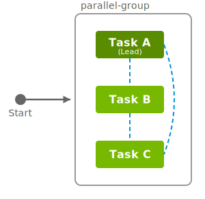

..
  SPDX-FileCopyrightText: Copyright (c) 2025 NVIDIA CORPORATION & AFFILIATES. All rights reserved.

  Licensed under the Apache License, Version 2.0 (the "License");
  you may not use this file except in compliance with the License.
  You may obtain a copy of the License at

  http://www.apache.org/licenses/LICENSE-2.0

  Unless required by applicable law or agreed to in writing, software
  distributed under the License is distributed on an "AS IS" BASIS,
  WITHOUT WARRANTIES OR CONDITIONS OF ANY KIND, either express or implied.
  See the License for the specific language governing permissions and
  limitations under the License.

  SPDX-License-Identifier: Apache-2.0

.. _tutorials_parallel_workflows:

==================
Parallel Workflows
==================

This tutorial teaches you how to create parallel workflows where multiple tasks
execute simultaneously, dramatically reducing overall execution time.

Parallel workflows allow you to:

- Run independent tasks concurrently
- Scale processing across many compute nodes
- Enable communication between tasks that need to coordinate

.. tip::

  Parallel workflows are ideal for:

  - Data parallel training
  - Batch processing large datasets
  - Independent task execution
  - Map-reduce patterns
  - Distributed training with multiple workers

By the end of this tutorial, you'll be able to build efficient parallel workflows
that maximize resource utilization.

.. important::

  OSMO provides two ways to achieve parallelism:

  1. **Independent tasks**: Tasks that run in parallel without needing to communicate
  2. **Groups**: Collections of tasks that execute together and can communicate over the network

  Use **tasks** for independent parallel work. Use **groups** when tasks need to coordinate
  or communicate (e.g., distributed training, client-server patterns).

**Independent Tasks**
=====================

**Asynchronous Parallelism**

Independent tasks run in parallel asynchronously when they:

1. Have no dependencies on each other
2. Are defined at the workflow level under ``tasks:``
3. Have available compute resources

**For example:**

.. figure:: independent_tasks.svg
  :align: center
  :width: 40%
  :class: transparent-bg no-scaled-link
  :alt: Independent Tasks

.. code-block:: yaml

  workflow:
    name: parallel-workflow
    tasks:
    - name: task-a
      # Runs in parallel with task-b and task-c

    - name: task-b
      # Runs in parallel with task-a and task-c

    - name: task-c
      # Runs in parallel with task-a and task-b

All three tasks start simultaneously (resource availability permitting). They cannot
communicate with each other over the network.

**Groups**
==========

**Synchronized Parallelism**

.. important::

   Groups are collections of tasks that execute together as a unit. All tasks in a group
   start simultaneously and can communicate over the network.

Key characteristics of groups:

- All tasks in a group start together (synchronized execution)
- Tasks can communicate with each other using ``{{host:task-name}}`` (see more at :ref:`Task Communication <tutorials_parallel_workflows_task_communication>`)
- One task must be designated as the **lead** task
- Groups run serially based on dependencies between them
- Tasks may run on the same node or different nodes

**For example:**

.. code-block:: yaml

  workflow:
    name: grouped-workflow
    groups:
    - name: parallel-group
      tasks:
      - name: task-a
        lead: true  # One task must be the leader
        # Can communicate with task-b and task-c

      - name: task-b
        # Can communicate with task-a and task-c

      - name: task-c
        # Can communicate with task-a and task-b

.. caution::

  The ``workflow`` level ``groups`` and ``tasks`` fields are **mutually exclusive**.
  You **cannot** use both in the same workflow.

.. _tutorials_parallel_workflows_task_communication:

Task Communication
==================

Tasks **within a workflow group** can communicate over the network using the token ``{{host:task-name}}``.
The token is replaced with the IP address of the task when the task is running.

**Example:**

.. code-block:: yaml

  - name: client-task
    command: ["bash", "-c"]
    args:
    - |
      # Wait for server to be ready
      while ! nslookup {{host:server-task}} > /dev/null 2>&1; do
        sleep 2
      done
      
      # Now communicate
      curl http://{{host:server-task}}:8080/data

.. tip::

  **Best practices for communication:**

  - ✅ Use ``nslookup`` or ``nc`` to wait for services to be ready
  - ✅ Start with simple protocols (HTTP) before complex ones
  - ✅ Handle connection retries gracefully

Next Steps
==========

You now understand parallel workflows! Continue to :ref:`Advanced Patterns <tutorials_advanced_patterns>`
to learn about complex workflow patterns and optimizations.

.. seealso::

  - :ref:`Workflow Specification <workflow_spec>`
  - :ref:`Resources and Pools <concepts_resources_pools_platforms>`
