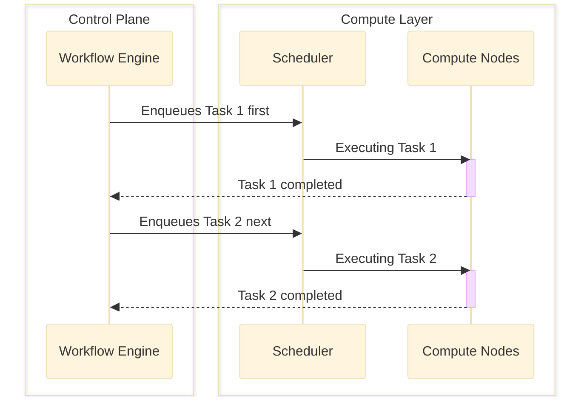

<!-- SPDX-FileCopyrightText: Copyright (c) 2025 NVIDIA CORPORATION & AFFILIATES. All rights reserved.

Licensed under the Apache License, Version 2.0 (the "License");
you may not use this file except in compliance with the License.
You may obtain a copy of the License at

http://www.apache.org/licenses/LICENSE-2.0

Unless required by applicable law or agreed to in writing, software
distributed under the License is distributed on an "AS IS" BASIS,
WITHOUT WARRANTIES OR CONDITIONS OF ANY KIND, either express or implied.
See the License for the specific language governing permissions and
limitations under the License.

SPDX-License-Identifier: Apache-2.0 -->

# Architecture

OSMO follows a **modular**, **cloud-native** architecture designed to orchestrate complex AI and
robotics workflows across **heterogeneous** compute resources.

## Control Plane

The OSMO control plane manages the entire lifecycle of your workflows:

**API Server**
: Provides RESTful APIs for workflow submission, monitoring, and management.
  Accessible through both CLI and Web UI interfaces.

**Workflow Engine**
: Parses YAML workflow specifications, orchestrates task execution, handles
  dependencies, and manages the workflow state machine.

**Authentication & Authorization**
: Integrates with external identity providers (OIDC, SAML) to
  manage user access and permissions.

## Compute Layer

OSMO connects to multiple Kubernetes clusters as compute backends:

**Pools & Platforms**
: Resources are organized into pools (logical groupings) and platforms
  (specific hardware types) allowing precise targeting of workloads.

**Heterogeneous Support**
: Connect cloud clusters (AKS, EKS, GKE), on-premise bare-metal
  clusters, and edge devices (NVIDIA Jetson) simultaneously.

**Scheduler**
: Leverages [NVIDIA Run:AI](https://developer.nvidia.com/blog/nvidia-open-sources-runai-scheduler-to-foster-community-collaboration/)
  to intelligently allocate GPU and CPU resources across workflows, optimizing for utilization
  and fairness.

**Container Orchestration**
: Each task in a workflow runs as a Kubernetes pod with specified
  container images, resource requirements, and environment configurations.

## Data Layer

OSMO manages data through an abstraction layer:

**Storage Backends**
: Supports S3-compatible object storage and Azure Blob Storage with
  configurable credentials.

**Data Injection**
: Automatically injects data into task containers at specified paths,
  enabling seamless access to inputs and outputs.

**Working with Control Plane**
: Integrates with the control plane’s **Dataset Service** to enable version-controlled storage for
  training data, models, and artifacts using [content-addressable storage](https://en.wikipedia.org/wiki/Content-addressable_storage).

## How It Works

### Submitting

1. User submits a workflow via the CLI or Web UI
2. API Server authenticates the user and validates the workflow specification
3. Workflow Engine parses and builds the workflow execution graph ([DAG](https://en.wikipedia.org/wiki/Directed_acyclic_graph) of tasks)
4. Workflow Engine enqueues tasks to the Scheduler for resource allocation

### Scheduling

After a task is enqueued to the Scheduler:

1. Scheduler evaluates the task’s resource requirements
2. Scheduler assigns the task to appropriate pools and platforms with available capacity
3. Compute Cluster creates a pod with specified container image, credentials, and environment variables

### Executing

1. Storage injects task inputs into the container
2. Compute Nodes executes the task using the injected inputs
3. Task outputs are persisted to Storage for downstream tasks and external access

> + For `datasets`, a task uses the Dataset Service to index the data for
> efficient storage and retrieval.

### Orchestrating

#### Serial Workflows

Tasks with dependencies execute sequentially in topological order:

#### Parallel Workflows

Independent tasks execute in parallel for maximum throughput:

#### Status Monitoring

Workflow Engine monitors task states and orchestrates execution based on
dependencies and outcomes:

1. Completed tasks trigger their dependent downstream tasks
2. Failed retryable tasks are re-enqueued for **automatic recovery**
3. Failed non-retryable tasks block their downstream dependencies

### Interacting

#### Observability

Tasks publishes logs and metrics to the API Server, enabling **real-time observability**.

#### Interactive Access

User can access RUNNING tasks for real-time interactive development
and debugging:

1. User initiates interactive access through the API Server
2. API Server coordinates with the Compute Nodes to establish a secured connection
3. User can interact with the Compute Nodes using the bi-directional streaming connection
   (e.g. `SSH`, `VSCode Remote`, `Jupyter`, etc.).

## Summary

This architecture enables OSMO to scale from a single developer workstation to massive cloud
deployments while maintaining a consistent interface and workflow experience.

#### SEE ALSO
For detailed deployment procedures, refer to the [Deployment Guide](../deployment_guide/index.md#deployment-guide-welcome).
