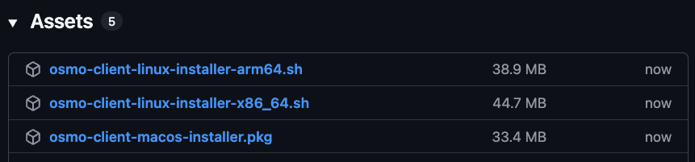
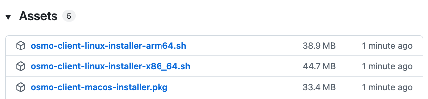

<!-- SPDX-FileCopyrightText: Copyright (c) 2025 NVIDIA CORPORATION & AFFILIATES. All rights reserved.

Licensed under the Apache License, Version 2.0 (the "License");
you may not use this file except in compliance with the License.
You may obtain a copy of the License at

http://www.apache.org/licenses/LICENSE-2.0

Unless required by applicable law or agreed to in writing, software
distributed under the License is distributed on an "AS IS" BASIS,
WITHOUT WARRANTIES OR CONDITIONS OF ANY KIND, either express or implied.
See the License for the specific language governing permissions and
limitations under the License.

SPDX-License-Identifier: Apache-2.0 -->

<a id="cli-install"></a>

# Install Client

To install the **latest release version** of the OSMO client, run the following command:

```bash
$ curl -fsSL https://raw.githubusercontent.com/NVIDIA/OSMO/refs/heads/main/install.sh | bash
```

## Specific versions

#### SEE ALSO
Visit the [GitHub Releases](https://github.com/NVIDIA/osmo/releases) page to
view all available release versions of the OSMO client.

From a specific release version page, navigate to the `Assets` section and download the
appropriate installer package for your operating system and CPU architecture.




## Login

> **Important**
>
> The OSMO client can only be used to connect to already deployed OSMO web services. Please contact your administrator
> and refer to the [Deployment Guides](../../../deployment_guide/introduction/whats_next.md#whats-next) for more information.

To login to the client, can use the following command:

```bash
$ osmo login https://<Your OSMO URL>/
```

After running the command above, you will be prompted to authenticate with the browser based OIDC authentication. For example:

```bash
Visit https://<Your OSMO URL>/device?user_code=ABCD-EFGH and complete authentication.
```

Grant access for OSMO application to authenticate you.


After successful authentication, you are logged in. Welcome to OSMO.


```bash
Successfully logged in. Welcome <Your Full Name>.
```
