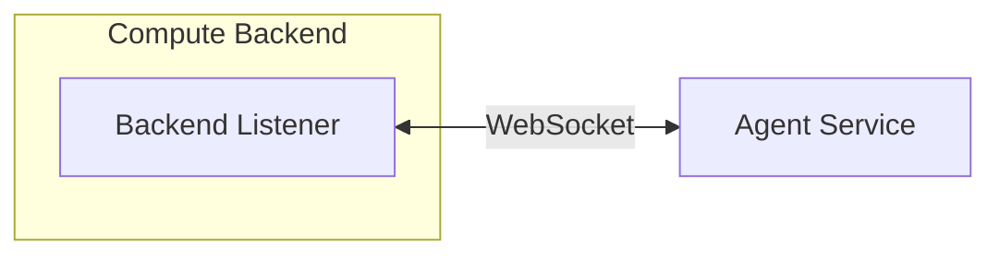
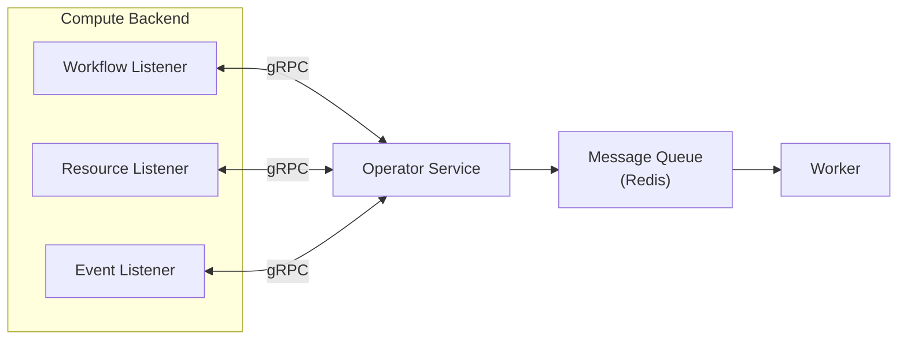
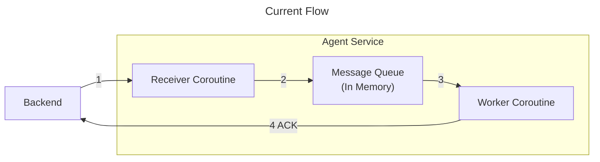
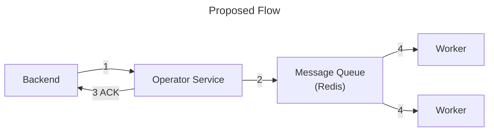

<!--
SPDX-FileCopyrightText: Copyright (c) 2025 NVIDIA CORPORATION. All rights reserved.

Licensed under the Apache License, Version 2.0 (the "License");
you may not use this file except in compliance with the License.
You may obtain a copy of the License at

http://www.apache.org/licenses/LICENSE-2.0

Unless required by applicable law or agreed to in writing, software
distributed under the License is distributed on an "AS IS" BASIS,
WITHOUT WARRANTIES OR CONDITIONS OF ANY KIND, either express or implied.
See the License for the specific language governing permissions and
limitations under the License.

SPDX-License-Identifier: Apache-2.0
-->

# Backend Operators Redesign

**Author**: [Xutong Ren](https://github.com/xutongNV)<br>
**PIC**: [Xutong Ren](https://github.com/xutongNV)<br>
**Proposal Issue**: [#147](https://github.com/nvidia/osmo/issues/147)

## Overview

This project aims to redesign the OSMO backend operator component to address critical scaling, reliability, and performance issues. The redesign will introduce horizontal scaling capabilities, improve multi-threading support, reduce memory footprint, and establish proper monitoring and testing infrastructure.

### Motivation

To prepare for future growth, OSMO's backend operators require architectural enhancements to support production workloads for Kubernetes backends at large scale. The current system provides a solid foundation, but can be optimized in several key areas: system stability under sustained load, event delivery consistency, and workflow status update latency.

This redesign will proactively strengthen OSMO's ability to support production-scale deployments reliably and efficiently as customer workloads continue to grow. Rewriting the backend listener using Golang will allow us to leverage native Kubernetes Go library for more performant operations and more built-in features (such as node/pod events caching).

### Problem

**Scaling**
- Agent Serice cannot scale horizontally to process backend messages

**Reliability**
- Backend Listener frequently restarts, impacting system availability

**Performance**
- Memory leaks in the listener component consume significant resources
- Workflow status update latency blocking user from exec and port forwarding
- Single-threaded listener design limits message throughput

**Observability**
- Lack of proper KPIs and logging infrastructure
- Insufficient test coverage makes it difficult to diagnose issues and measure system health

## Use Cases

| Use Case | Description |
|---|---|
| Large computing backend | Backend operator needs to be able to handle a large computing backends, e.g. a k8s cluster with 2k nodes |
| User exec into their task | A user can exec into his task as soon as the task becomes running |

## Requirements

| Title | Description | Type |
|---|---|---|
| Scalability | Agent service shall handle multiple backend messages in parallel and be able to horizontally scale | Scalability |
| Event Caching | Backend operator shall cache Kubernetes events to reduce API server load and improve response times | Performance |
| Message Compacting | Agent server shall compact messages and deduplicate stale message to improve processing times | Performance |
| Data Accuracy | Backend operator shall provide accurate and up-to-date workflow and resource status information | Reliability |
| Low Latency | Backend operator shall update workflow status with minimal latency to enable timely user actions (exec, port forwarding) | Performance |
| Recoverability | Backend operator shall be able to recover from failures without data loss | Reliability |
| Traceability | Backend operator shall provide structured logging for debugging and auditing purposes | Observability |
| KPI Dashboard | Backend operator shall expose KPIs and metrics for monitoring system health and outage alarts| Observability |
| No Message Drop | Backend operator shall ensure no message drops | Reliability |
| Resource Efficiency | Backend operator shall utilize CPU efficiently and prevent memory leaks | Performance |
| System Robustness | Backend operator shall operate without frequent restarts and maintain stability under load | Reliability |

## Architectural Details

#### Current Architecture



**Component Description:**
- **Backend Listener**: Listens to pod, node, backend events across ALL namespaces
- **Agent Service**: Receives backend messages and processes them in order

#### Proposed Architecture



**Component Description:**

- **Workflow Listener**: Listens to pod status changes in OSMO namespace
- **Resource Listener**: Listens to pod, node events and aggregrating resource usages
- **Event Listener**: Listens to scheduler events
- **Operator (renamed from Agent) Service**: Receives backend messages, puts them in the message queue and acknoledges
- **Message Queue (Redis)**: Message broker for compacting and asynchronous processing
- **Worker**: Task executor that processes messages from the queue

## Detailed Design

### Decouple Backend Listener (Golang)

Current Backend Listener does the following things as multiple threads / coroutines in a single Python script:

- **4 Threads** watching Kubernetes resources:
  - `watch_pod_events` - Monitors pod status changes in ALL namespaces
  - `watch_node_events` - Monitors node events across cluster
  - `watch_backend_events` - Monitors cluster-level scheduler events
  - `get_service_control_updates` - Receives control messages from Agent service (e.g., node condition rules)
- **6 Coroutines** managing WebSocket communication:
  - `heartbeat` - Sends periodic heartbeat messages
  - 5 `websocket_connect` coroutines maintaining separate WebSocket connections for CONTROL, POD, NODE, EVENT, and HEARTBEAT message types

Due to the complexity of Backend Listener's functionalities and limitations of Python (GIL preventing true parallelism), we observe low CPU utilization, message processing delays, and difficulty scaling to large Kubernetes clusters.

The proposed architecture divided Backend Listener into 3 aspects: Updating OSMO pod status (most important), aggregating resource usages and stream scheduling events.

Decoupling Backend Listener into separate Go-based services leverages Go's goroutines to achieve true parallelism and higher CPU utilization, simplifies management by giving each listener a single well-defined responsibility, and most importantly, gives workflow status updates prioritization so that they are no longer blocked by high-volume resource/node messages.

### Deprecate Backend Heartbeat

Currently Backend Listener sends heartbeats following a schedule to Agent Service. Agent Service updates Database with `last_heatbeat` to determine whether a backend is marked as `online`. Based on the following considerations the new resign will deprecate the heartbeat message and backend online status:

- Heartbeat is not reliablly sent and its frequency requires tunning for different compute backend sizes due to current implementation: loads in other threads cause the effective frequency much lower than expected
- Current backend online status is not accurate since it does not take Backend Worker into consideration
- Workflows are not blocked if a backend is offline

Therefore, this design removes the needs of backend heartbeat messages and backend online status, and establishes the following:

- Each backend container has its own liveness prob and alarts if the pod errors or terminates (**already acheived**)
- Pool online status changes to a flag of whether the pool is in maintaince or not. OSMO service blocks workflow submissions based on it.

### Cache Messages on Backend Side

Caching on the backend side reduces the amount of messages Backend Listener has to send. The current implementation of caching drops duplicated events that have been seen within a time window. Golang
has native support of cahcing in its k8s library but we need to provide a cache to track status change. The two implementations use different mechanisms:

#### Python Implementation (Watch API)

**Mechanism:** Streaming with client-side filtering and single-level caching

```
cache = LRUCacheTTL(size, ttl)

while True:
    stream = API_SERVER.watch_all_pods(namespace)

    for pod_event in stream:
        # Client receives ALL pods, must filter locally
        if pod NOT labeled with "osmo.task_uuid":
            skip
        if pod NOT labeled with "osmo.workflow_uuid":
            skip

        # Check if (pod + status) combination exists in cache
        if (pod, status) NOT in cache:
            send_to_worker_queue(pod)
            cache.add((pod, status))  # Cache this combination for TTL duration
```

#### Go Implementation (Informer Pattern)

**Mechanism:** Event-driven with server-side filtering and two-level caching

```
state_tracker = StateTracker(ttl)

# Server-side filter: only watch pods with both labels
informer = create_informer(
    namespace,
    label_selector="osmo.task_uuid,osmo.workflow_uuid"
)

# Informer maintains its own cache of matching pods
informer.register_handlers({
    on_add:    func(pod) { handle_update(pod) },
    on_update: func(pod) { handle_update(pod) },
    on_delete: func(pod) { handle_delete(pod) }
})

# Sync informer's cache with API server, then start
informer.sync_cache()
informer.start()

func handle_update(pod):
    previous_status = state_tracker.get(pod)
    if pod.status != previous_status:  # Check if status actually changed
        send_to_worker_queue(pod)
        state_tracker.update(pod, pod.status)  # Remember new status
```


#### Key Differences

| Aspect | Current | Proposed |
|--------|-------------------|---------------|
| **Filtering** | Client-side (all pods received) | Server-side (only OSMO pods received) |
| **Caching** | Single-level (LRUCacheTTL) | Two-level (Informer + state tracker) |
| **Network** | Streams all pod events | Receives only filtered events |
| **Event Handling** | Single loop with conditions | Separate Add/Update/Delete handlers |
| **Cache Sync** | Manual reconnection on error | Automatic resync with `WaitForCacheSync` |
| **Initial Load** | Processes all existing pods on startup | Informer caches pods before event handling |

#### Performance Impact

1. **Network Efficiency**: Go's server-side filtering significantly reduces bandwidth, especially in large clusters with many non-OSMO pods
2. **CPU Usage**: Python does more client-side work filtering irrelevant events
3. **Memory**: Go's informer maintains a local cache of all watched pods, slightly higher memory but faster lookups
4. **Startup Time**: Go waits for cache sync before processing, ensures consistency from the start
5. **Error Recovery**: Go's informer automatically handles reconnection and cache resync without data loss

### Decouple Agent Service

Current Agent Service handles multiple responsibilities as asynchronized funcitons in a single Python script:

- Connects to Backend Worker and executes Backend Jobs
- Connects to Backend Listener for CONTROL, POD, NODE, EVENT, and HEARTBEAT message types

In the proposed design, the Backend Worker endpoint will be split from Backend Listener endpoints. This separation allows Operator (Agent) Service to scale independently based on workload type, improves CPU and memory management, reduces corountine switching overheads, and enables parallel processing of listener messages and job execution tasks.

### gRPC connections between Backend Listeners and Operator Services

Using gRPC instead of WebSocket to better handle back-pressure, which occurs frequently since the current Agent Service processes messages sequentially. gRPC also provides more reliable connections and lower latency compared to WebSocket.

This design retains the current ACK mechanism, which was initially designed to handle back-pressure. The ACK mechanism also prevents message loss in case of Operator Service failures without requiring a full resync of all backend events.

The real bottleneck of the status update latency is not the networking protocol, but the speed at which the Operator Service processes messages. The key to improving latency is making the Operator Service handle messages asynchronously.





### Operator Service with Asynchronous Processing

The real bottleneck of status update delays and lack of scalability is the sequential processing mechanism of Agent Service.
Due to implementation limitations, Agent Service processes messages in the receiving order sequentially. The sequentiality is also a correctness requirement since the messages do not capture time information except the order.
Agent Service will hold a certain amount of unprocessed messages in a memory queue and only ACK a message when it is processed. This also causes messages to pile up on the backend side and leads to memory increase over time.

To make it scalable and parallel, this design introduces a message queue. Operator Service now receives a message, puts it into the queue, and acks it. This should be completed in a fairly small amount of time and alleviates the back pressure of the connection, reducing message congestion on the backend side. Backend Listeners do not need to hold unacked messages until they are processed. On the other side, multiple workers can work on processing messages in parallel, and this can be scaled up based on needs.

### Message Queue

To ensure correctness of the asynchronous workers, message timestamps are required from the backend. With timestamps, workers can determine the most recent state and discard stale updates when processing messages in parallel.

The message queue can be equipped with compacting and deduplication mechanisms to reduce the number of unprocessed messages. For multiple updates to the same resource, only the most recent message needs to be processed, while earlier messages can be safely discarded as they represent intermediate states.

Different message types are associated with different queues, and workers can prioritize one queue over others (e.g., workflow status updates).

### Backwards Compatibility

No. Service and Backend Operator have to be upgraded to the same version

### Documentation

- [ ] Update OSMO Deployment Guide

### Testing

_What unit, integration, or end-to-end tests need to be created or updated? How will these tests be integrated in automation? What test metrics will be tracked and what are KPIs?_

## Implementation Plan

### Phase 1: Workflow Listener

**Milestone**: Split Workflow Listener out of Backend Listener

**Tasks**:
- [ ] Create Workflow Listener in Go
- [ ] Create Operator Service endpoint seperate from current Agent Service
- [ ] Setup networking and message type proto between those
- [ ] Setup basic Redis Message Queue
- [ ] Setup worker

**Deliverables**:
- [ ] Functional Workflow Listener cooperated that can work alongside the current architecture

**Tests & Benchmarking**:
- [ ] Unit tests for networking and message queue
- [ ] Benchmark for update latency etc
- [ ] Load test for large backend cluster

---

### Phase 2: Resource Listener and Event Listener

**Milestone**: Split the rest listeners

**Tasks**:
- [ ] Create Resource Listener
- [ ] Create Event Listener

**Deliverables**:
- [ ] Resource Listener
- [ ] Event Listener

**Tests & Benchmarking**:
- [ ] Unit tests for networking and message queue
- [ ] Benchmark for update latency etc
- [ ] Load test for large backend cluster
- [ ] End-to-end test on real backend clusters

## Open Questions

- [ ] Backend Worker cant receive job spec for workflows with > 500 tasks
- [ ] Operator Service in Python or Go?
- [ ] Is Agent service needed? Can Backend Listeners connects to the Message Queue?
- [ ] Sending logs to Agent Service and print them out is a tricky implementation. Can we using service sidecar for Backend Operator logs?
- [ ] Make use of k8s API metrics server to compute resource usage
