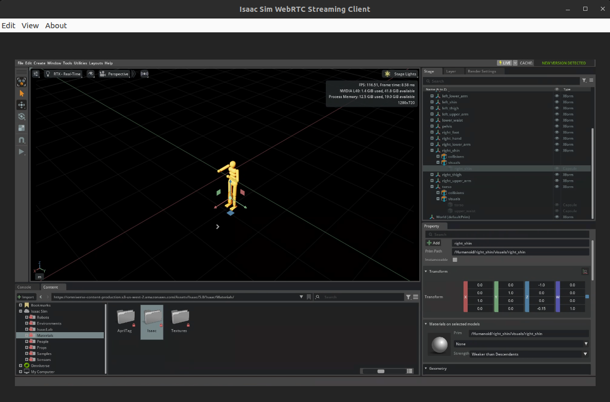

<!--
SPDX-FileCopyrightText: Copyright (c) 2025 NVIDIA CORPORATION & AFFILIATES. All rights reserved.

Licensed under the Apache License, Version 2.0 (the "License");
you may not use this file except in compliance with the License.
You may obtain a copy of the License at

http://www.apache.org/licenses/LICENSE-2.0

Unless required by applicable law or agreed to in writing, software
distributed under the License is distributed on an "AS IS" BASIS,
WITHOUT WARRANTIES OR CONDITIONS OF ANY KIND, either express or implied.
See the License for the specific language governing permissions and
limitations under the License.

SPDX-License-Identifier: Apache-2.0
-->

# NVIDIA OSMO - Isaac Sim Livestream

This example demonstrates how to run NVIDIA Isaac Sim on OSMO with livestream capabilities. NVIDIA Isaac Sim is an application built on NVIDIA Omniverse that enables developers to develop, simulate, and test AI-driven robots in physically-based virtual environments.

OSMO supports running Isaac Sim in a cloud environment with livestream clients enabled by port forwarding, allowing you to interact with Isaac Sim remotely through a streaming client.

## Prerequisites

- Access to an OSMO cluster with RTX GPU resources and supported GPU driver version (check [system requirements](https://docs.isaacsim.omniverse.nvidia.com/latest/installation/requirements.html))
- Isaac Sim livestream client installed on your local machine ([Installation Guide](https://docs.isaacsim.omniverse.nvidia.com/5.0.0/installation/manual_livestream_clients.html))

### Checking Available Resources

Isaac Sim requires an RTX GPU with a supported driver version. To check available resources in OSMO:

```bash
osmo resource list
```

Depending on your use cases, you may need to increase CPU, memory, and disk resources accordingly.

## Running this workflow

```bash
curl -O https://raw.githubusercontent.com/NVIDIA/OSMO/main/workflow_examples/integration_and_tools/isaacsim/sim.yaml
osmo workflow submit sim.yaml
```

## Accessing Isaac Sim

Once the workflow is running, it can take a few minutes for Isaac Sim to load. Make sure the streaming service is up by checking the workflow logs for this line:

```
Isaac Sim Full Streaming App is loaded.
```

After the streaming service is up, forward the ports to your local machine. The following ports need to be forwarded: TCP/UDP 47995-48012, TCP/UDP 49000-49007, and TCP 49100.

Run these commands in two separate terminals:

```bash
# Terminal 1: TCP ports
osmo workflow port-forward <workflow-id> stream --port 47995-48012,49000-49007,49100 --connect-timeout 300
```

```bash
# Terminal 2: UDP ports
osmo workflow port-forward <workflow-id> stream --port 47995-48012,49000-49007 --udp --connect-timeout 300
```

Wait several seconds for the ports to be forwarded, then you can access Isaac Sim in the streaming client on your local machine.


## Important Notes

- Each Isaac Sim instance can only connect to one Streaming Client. Connecting to an Isaac Sim instance that is currently serving a Streaming Client will result in an error for the second user.
- When closing clients, please shutdown all port-forward commands to ensure connections are properly cleaned up.
- Lower resolution results in less latency for better streaming performance.


