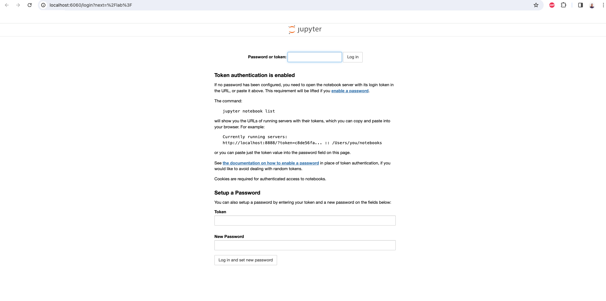

<!--
SPDX-FileCopyrightText: Copyright (c) 2025 NVIDIA CORPORATION & AFFILIATES. All rights reserved.

Licensed under the Apache License, Version 2.0 (the "License");
you may not use this file except in compliance with the License.
You may obtain a copy of the License at

http://www.apache.org/licenses/LICENSE-2.0

Unless required by applicable law or agreed to in writing, software
distributed under the License is distributed on an "AS IS" BASIS,
WITHOUT WARRANTIES OR CONDITIONS OF ANY KIND, either express or implied.
See the License for the specific language governing permissions and
limitations under the License.

SPDX-License-Identifier: Apache-2.0
-->

# NVIDIA OSMO - JupyterLab

This workflow launches a JupyterLab server that can be accessed remotely for interactive development and data science work. It runs a single task that starts JupyterLab on port 6060 configured for remote access, allowing you to work with notebooks, scripts, and datasets in a familiar Jupyter environment.

## Running this workflow

```bash
curl -O https://raw.githubusercontent.com/NVIDIA/OSMO/main/workflow_examples/integration_and_tools/jupyterlab/jupyter.yaml
osmo workflow submit jupyter.yaml
```

## Accessing JupyterLab

Once the task is running, run the port-forward command:

```bash
# Get the workflow ID from the submit command output
osmo workflow port-forward <workflow-id> notebook --port 6060:6060
```

Once this command is running, open your browser and navigate to `http://localhost:6060` to access the JupyterLab interface.



