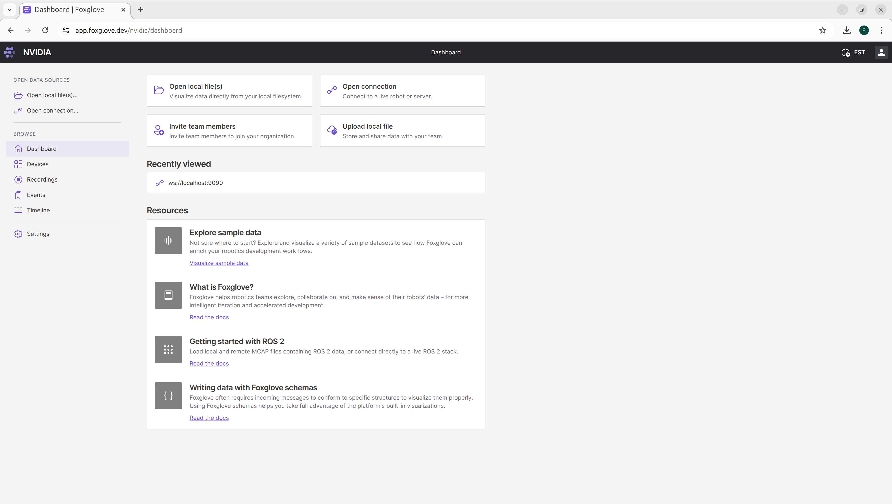
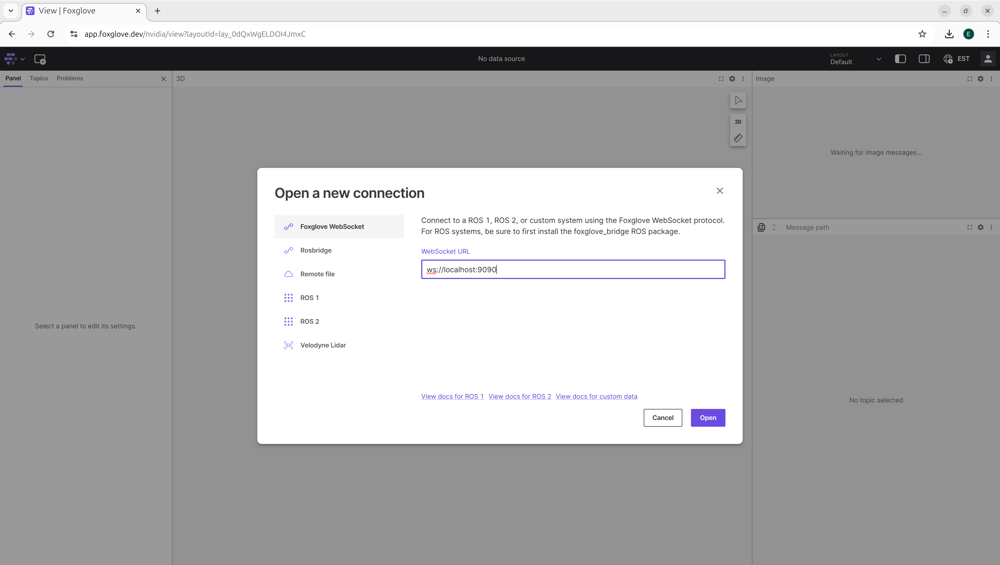
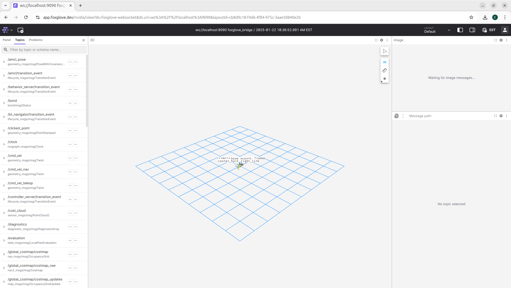
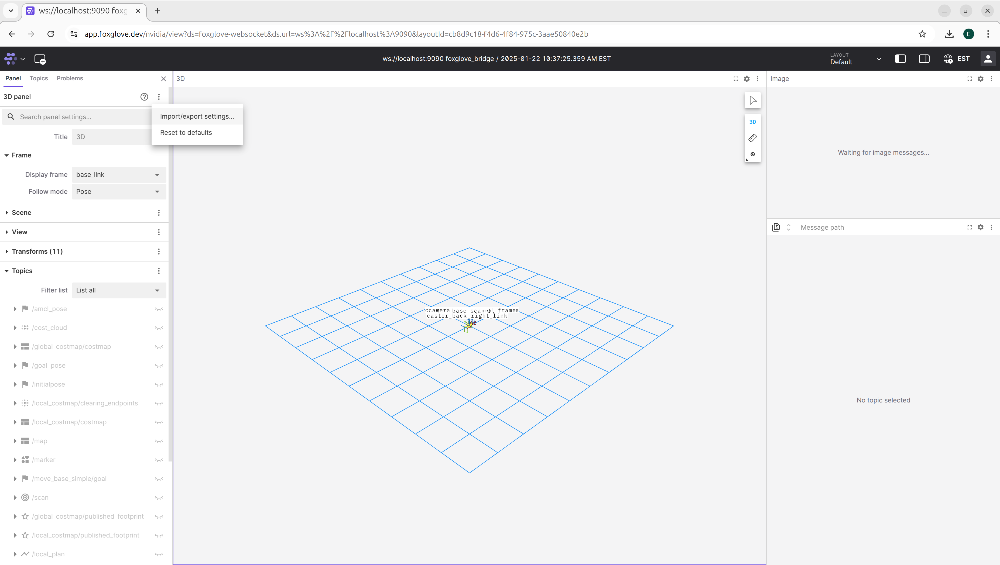
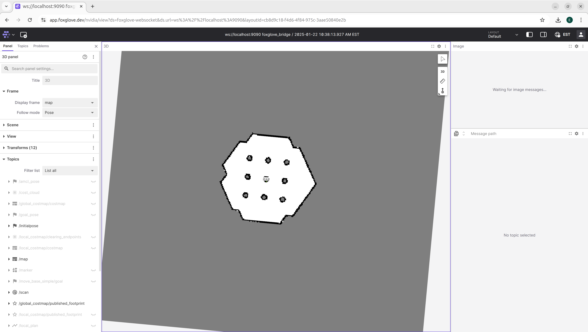

<!--
SPDX-FileCopyrightText: Copyright (c) 2025 NVIDIA CORPORATION & AFFILIATES. All rights reserved.

Licensed under the Apache License, Version 2.0 (the "License");
you may not use this file except in compliance with the License.
You may obtain a copy of the License at

http://www.apache.org/licenses/LICENSE-2.0

Unless required by applicable law or agreed to in writing, software
distributed under the License is distributed on an "AS IS" BASIS,
WITHOUT WARRANTIES OR CONDITIONS OF ANY KIND, either express or implied.
See the License for the specific language governing permissions and
limitations under the License.

SPDX-License-Identifier: Apache-2.0
-->

# NVIDIA OSMO - ROS2 Turtlebot Simulation with Foxglove Visualization

This workflow demonstrates the classic ROS2 Turtlebot example and streams the simulated robot's topics to Foxglove, a popular visualization client for robotics.

This workflow showcases Software-In-Loop (SIL) evaluation by launching:

- **Turtlebot3 robot simulation in Gazebo** - Physics simulation of the Waffle model
- **Navigation2 (Nav2) stack** - Autonomous navigation with path planning and control
- **Foxglove bridge** - Streams robot data for visualization on port 9090

## Files

- `turtlebot_demo.yaml`: Workflow configuration that defines the Turtlebot simulation task
- `turtlebot.json`: Foxglove panel settings for visualizing the robot with occupancy map

## Running this workflow

```bash
curl -O https://raw.githubusercontent.com/NVIDIA/OSMO/main/workflow_examples/ros/turtlebot/turtlebot_demo.yaml
osmo workflow submit turtlebot_demo.yaml
```

## Visualizing with Foxglove

Once the workflow is running, you can visualize the robot data using Foxglove:

### Open Foxglove

Navigate to [https://app.foxglove.dev](https://app.foxglove.dev) in your browser.



### Wait for Initialization

Check the workflow logs to ensure the Turtlebot has finished initializing.
Wait until you see log messages like:

```
[INFO] [local_costmap.local_costmap]: Activating
[INFO] [local_costmap.local_costmap]: Checking transform
```

### Port-forward the Foxglove Connection

Once initialized, forward the Foxglove websocket port:

```bash
osmo workflow port-forward <workflow-id> turtlebot-gazebo --port 9090:9090 --connect-timeout 1000
```

### Connect Foxglove to Your Workflow

1. In the Foxglove UI, click **Open connection**
2. Select **Foxglove Websocket**
3. Enter the connection URL: `ws://localhost:9090`
4. Click **Open**



You should now see the robot frame appear in Foxglove:



### Import Visualization Settings

To see the occupancy map and full visualization:

1. In the 3D panel, click the options menu (three vertical dots)
2. Select **Import/export settings**
3. Import the contents of `turtlebot.json` file



After applying these settings, you'll see the complete map and robot visualization in Foxglove:


