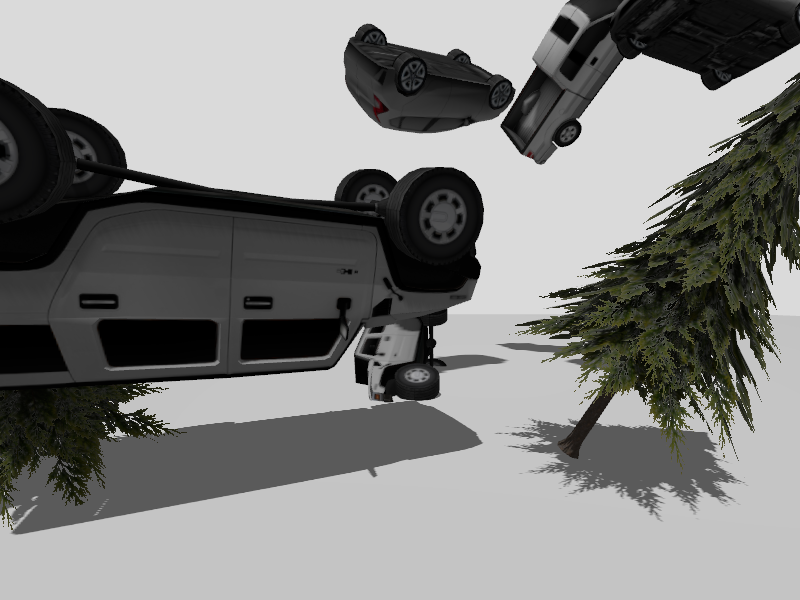

<!--
SPDX-FileCopyrightText: Copyright (c) 2025 NVIDIA CORPORATION & AFFILIATES. All rights reserved.

Licensed under the Apache License, Version 2.0 (the "License");
you may not use this file except in compliance with the License.
You may obtain a copy of the License at

http://www.apache.org/licenses/LICENSE-2.0

Unless required by applicable law or agreed to in writing, software
distributed under the License is distributed on an "AS IS" BASIS,
WITHOUT WARRANTIES OR CONDITIONS OF ANY KIND, either express or implied.
See the License for the specific language governing permissions and
limitations under the License.

SPDX-License-Identifier: Apache-2.0
-->

# NVIDIA OSMO - Gazebo Synthetic Data Generation

This workflow demonstrates synthetic data generation using the Gazebo simulator. It launches Gazebo with a segmentation world, randomly places objects (vehicles, trees, cones) in the scene, captures synthetic images with semantic labels, and saves them to a dataset.

## Files

- `sdg.yaml`: Workflow configuration that defines the synthetic data generation task
- `sdg.py`: Python script that controls Gazebo simulation and captures images
- `segmentation_world.sdf`: Gazebo world file containing the scene with objects

## Running this Workflow

```bash
curl -O https://raw.githubusercontent.com/NVIDIA/OSMO/main/workflow_examples/synthetic_data_generation/gazebo/gazebo_sdg.yaml
curl -O https://raw.githubusercontent.com/NVIDIA/OSMO/main/workflow_examples/synthetic_data_generation/gazebo/sdg.py
curl -O https://raw.githubusercontent.com/NVIDIA/OSMO/main/workflow_examples/synthetic_data_generation/gazebo/segmentation_world.sdf
osmo workflow submit gazebo_sdg.yaml
```

## Downloading Output Dataset

Once the workflow is completed, download the generated dataset:

```bash
osmo dataset download gazebo-sdg-sample <local_folder>
```

## Example Output


